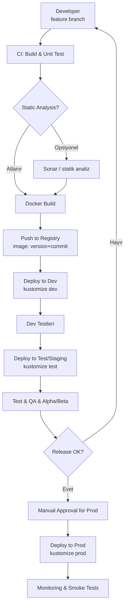
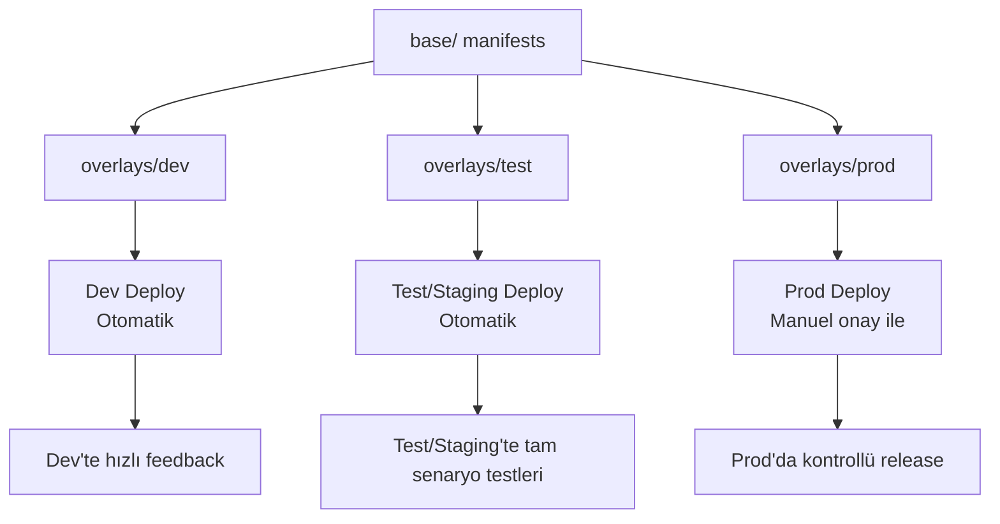

# Kubernetes Üzerinde Versioning ve Releasing Yönetimi

*Küçük veya orta ölçekli, kalabalık olmayan ekipler için basit bir yol haritası*

Bu yazı; kod geliştirme, versionlama, container build süreçleri ve Kubernetes üzerinde release yönetimi için sade bir yaklaşım sunar.  
Buradaki adımlar ekip büyüklüğüne, kültüre, teknik ortama, ürüne veya regulasyonlara göre mutlaka **özelleştirilmeli**; katı kurallar değil, pratik bir başlangıç rehberi olarak görülmelidir.


## 1. Genel Prensipler

- Git her zaman tek doğru kaynak (**Single Source of Truth**) olmalıdır.
- Kod, Kubernetes YAML dosyaları, kustomize template’leri ve konfigürasyonlar Git üzerinde versiyonlanır.
- Container tag’leri **SemVer + build number / commit hash** modeli ile yönetilir.
- Dev ve Test/Staging ortamlarında otomasyon yüksek tutulur, Prod ortamında ise her zaman manuel bir kontrol katmanı bulunur.
- Küçük ekiplerde karmaşık araç setlerinden kaçınmak, süreçleri basit tutmak sürdürülebilirliği artırır.


## 2. Aşama 1 – Kod Release Süreci

### 2.1. Branching Modeli

- **main:** Sadece prod’a giden kararlı kod.
- **dev:** Test edilecek entegre kod.
- **feature/\***: Yeni özellik geliştirme branch’leri.
- **hotfix/\***: Prod ortamı hataları için hızlı düzeltmeler.

### 2.2. Kod Geliştirme ve Release Akışı

1. **Feature branch oluşturulur.**
2. Kod geliştirilir, küçük ve anlamlı commit mesajlarıyla ilerlenir.
3. **Statik analiz (SonarQube vb.) – opsiyonel olarak değerlendirilebilir.**
4. Unit test’ler çalıştırılır.
5. README güncellenir:
   - Servisin nasıl çalıştırılacağı
   - Upgrade adımları
   - Gerekli environment değişkenleri ve konfigürasyon bilgileri
6. Container build edilir ve versiyonlama yapılır. Örneğin:
   - `1.3.0-45`
   - `1.3.0-a82d9f1b`
7. Build edilen imaj registry’e push edilir.
8. `feature/*` → `dev` için Pull Request oluşturulur, code review sonrası merge edilir.
9. Release kararı verildiğinde `dev` → `main` merge edilir ve tag oluşturulur:
   - `v1.3.0`


## 3. Aşama 2 – Version Release Süreci (Kubernetes)

### 3.1. Test / Staging Ortamında Deploy

1. Test/Staging overlay veya manifest dosyasında image tag güncellenir.
2. Pipeline tetiklenerek Kubernetes’e deploy edilir.
3. Güvenlik, performans ve fonksiyonel testler uygulanır.
4. Gerekiyorsa alpha/beta kullanıcı testleri yapılır.

### 3.2. Hata Durumunda Fix Akışı

```mermaid
flowchart TD
    A[Bug tespit] --> B[Issue aç]
    B --> C{Kritiklik?}
    C -->|Kritik| D[hotfix branch]
    C -->|Normal| E[feature veya mevcut branch]
    D --> F[Fix geliştir]
    E --> F
    F --> G[CI: test + build]
    G --> H[Container push]
    H --> I[Test/Staging deploy]
    I --> J[Regression test]
    J --> K{Çözüldü mü?}
    K -->|Evet| L[Prod release adayı]
    K -->|Hayır| B
````

Fix çıkan versiyon, ihtiyaç halinde ilgili diğer feature branch’lere de (örneğin `cherry-pick` ile) uygulanabilir.


### 3.3. Temiz Kurulum ve Upgrade Testleri

* Yeni versiyon önce **temiz bir namespace** üzerinde sıfırdan kurulup test edilir.
* Ardından bir önceki stabil versiyondan **upgrade senaryosu** çalıştırılır; veri migrasyonları ve geriye dönük uyumluluk kontrol edilir.

### 3.4. Prod Release

1. Prod manifestlerinde image tag güncellenir.
2. Prod ortamında otomatik deploy çalışmaz; manuel “review & approve” katmanı bulunur.
3. DevOps / Platform Engineer, diff’i ve konfigürasyon değişikliklerini kontrol eder.
4. Onay sonrası deploy yapılır.
5. Gerekli migration’lar uygulanır, health check ve smoke test’ler çalıştırılır.
6. Release tamamlanır ve monitor edilir.


## 4. Konfigürasyon Yönetimi ve Kubernetes YAML Yapısı

Bu modelde Helm yerine çoğunlukla **kustomize + saf YAML** yaklaşımı tercih edilir.

Önerilen dizin yapısı:

```text
k8s/
  service-name/
    base/
    overlays/
      dev/
      test/
      prod/
```

* Ortak tanımlar `base/` altında tutulur.
* Ortam bazlı farklar `overlays/*` klasörlerinde yönetilir.
* Staging ortamlarında süreçler tam otomatik olabilir.
* Prod ortamında hiçbir şey tamamen otomatik uygulanmaz; mutlaka manuel bir gözden geçirme katmanı bulunur.


## 5. Ekip Rolleri ve Sorumluluklar

### Product Owner

* Use-case ve story’leri belirler.
* Sprint planlarını ve release takvimini oluşturur.
* Architect ile birlikte teknik kapsam ve öncelikleri belirler.

### Tech Lead / Architect

* Teknik tasarımı ve mimariyi belirler.
* Servis sınırlarını, entegrasyon modellerini ve veri akışını tanımlar.
* Teknik issue’ların nasıl yapılacağını genel hatlarıyla çizer.
* Gerektiğinde code review süreçlerine katılır.
* Versioning, release ve teknik kalite standartlarını oluşturur.

### DevOps / Platform Engineer

* Kubernetes ortamlarını yönetir.
* YAML/kustomize konfigürasyonlarını ve ortam versiyonlamasını yönetir.
* CI/CD pipeline’larını kurar ve sürdürür.
* Güvenlik, secret yönetimi, izleme ve loglama altyapılarını yönetir.
* Prod ortamındaki manuel **review & apply** sürecini yürütür.

Bu roller ekip yeteneklerine göre birleştirilebilir veya ayrıştırılabilir. Küçük ekiplerde bazı roller aynı kişide bulunabilir; önemli olan sorumlulukların net olmasıdır.


## 6. Genel Özet

* Kod, feature branch’lerde geliştirilir ve `dev` branch’ine PR ile alınır.
* Unit test + build + opsiyonel statik analiz çalıştırılır.
* Container build edilir; **SemVer + build/commit tag** ile registry’e gönderilir.
* Staging ortamlarına otomatik, prod ortamına manuel gate ile deploy yapılır.
* Kustomize/saf YAML Git üzerinden versiyonlanır ve ortam bazlı yönetilir.
* Release süreci her zaman temiz kurulum + upgrade testleriyle doğrulanır.
* Tüm süreç, ekip kültürüne ve ortama göre sade ama esneyebilir şekilde tasarlanır.


## Ek A – Örnek CI/CD Pipeline Şablonu

Aşağıdaki örnek, Jenkins / Jenkins-X benzeri bir ortam için genel bir şablondur.

* Build + test
* (Opsiyonel) statik analiz
* Docker build & push
* Dev → Test otomatik
* Prod için manuel onay

```groovy
pipeline {
    agent any

    environment {
        REGISTRY      = 'registry.example.com'
        APP_NAME      = 'invoice-service'
        VERSION       = '1.3.0'                // Manuel/otomatik set edilebilir
        GIT_COMMIT_ID = "${env.GIT_COMMIT}"    // Jenkins otomatik doldurur
        IMAGE_TAG     = "${VERSION}-${GIT_COMMIT_ID.take(8)}"
        IMAGE         = "${REGISTRY}/${APP_NAME}:${IMAGE_TAG}"
        K8S_DIR       = 'k8s/invoice-service'
        RUN_SONAR     = 'false'               // İhtiyaca göre true/false
    }

    stages {
        stage('Checkout') {
            steps {
                checkout scm
            }
        }

        stage('Build & Unit Tests') {
            steps {
                sh """
                  ./gradlew clean test       // kendi build komutunla değiştir
                """
            }
        }

        stage('Static Analysis (optional)') {
            when {
                expression { env.RUN_SONAR == 'true' }
            }
            steps {
                sh """
                  ./gradlew sonarqube       // örnek Sonar taraması
                """
            }
        }

        stage('Docker Build & Push') {
            steps {
                sh """
                  docker build -t ${IMAGE} .
                  docker push ${IMAGE}
                """
            }
        }

        stage('Deploy to Dev') {
            steps {
                sh """
                  cd ${K8S_DIR}/overlays/dev
                  kustomize edit set image ${REGISTRY}/${APP_NAME}=${IMAGE}
                  kustomize build . | kubectl apply -f -
                """
            }
        }

        stage('Deploy to Test') {
            steps {
                sh """
                  cd ${K8S_DIR}/overlays/test
                  kustomize edit set image ${REGISTRY}/${APP_NAME}=${IMAGE}
                  kustomize build . | kubectl apply -f -
                """
            }
        }

        stage('Manual Approval for Prod') {
            steps {
                script {
                    timeout(time: 1, unit: 'HOURS') {
                        input message: "Prod ortamına ${IMAGE_TAG} versiyonunu deploy etmek istiyor musun?"
                    }
                }
            }
        }

        stage('Deploy to Prod') {
            steps {
                sh """
                  cd ${K8S_DIR}/overlays/prod
                  kustomize edit set image ${REGISTRY}/${APP_NAME}=${IMAGE}
                  kustomize build . | kubectl apply -f -
                """
            }
        }
    }
}
```

> `./gradlew` yerine kendi build komutlarını, `kustomize` yerine gerekiyorsa `kubectl kustomize` vb. komutları kullanabilirsin.


## Ek B – Örnek Kustomize Template Seti

### Dizim Yapısı

```text
k8s/
  invoice-service/
    base/
      deployment.yaml
      service.yaml
      kustomization.yaml
    overlays/
      dev/
        kustomization.yaml
        configmap-dev.yaml
      test/
        kustomization.yaml
        configmap-test.yaml
      prod/
        kustomization.yaml
        configmap-prod.yaml
        hpa-prod.yaml
```

### 1. `base/kustomization.yaml`

```yaml
apiVersion: kustomize.config.k8s.io/v1beta1
kind: Kustomization

resources:
  - deployment.yaml
  - service.yaml
```

### 2. `base/deployment.yaml`

```yaml
apiVersion: apps/v1
kind: Deployment
metadata:
  name: invoice-service
  labels:
    app: invoice-service
spec:
  replicas: 2
  selector:
    matchLabels:
      app: invoice-service
  template:
    metadata:
      labels:
        app: invoice-service
    spec:
      containers:
        - name: invoice-service
          image: registry.example.com/invoice-service:latest   # overlay ile override edilecek
          ports:
            - containerPort: 8080
          env:
            - name: LOG_LEVEL
              value: "Info"
          readinessProbe:
            httpGet:
              path: /health
              port: 8080
            initialDelaySeconds: 5
            periodSeconds: 10
          livenessProbe:
            httpGet:
              path: /health
              port: 8080
            initialDelaySeconds: 15
            periodSeconds: 20
```

### 3. `base/service.yaml`

```yaml
apiVersion: v1
kind: Service
metadata:
  name: invoice-service
  labels:
    app: invoice-service
spec:
  selector:
    app: invoice-service
  ports:
    - port: 80
      targetPort: 8080
      protocol: TCP
      name: http
  type: ClusterIP
```


### 4. `overlays/dev/kustomization.yaml`

```yaml
apiVersion: kustomize.config.k8s.io/v1beta1
kind: Kustomization

resources:
  - ../../base

images:
  - name: registry.example.com/invoice-service
    newTag: dev-latest   # Pipeline burada gerçek tag ile override edecek

configMapGenerator:
  - name: invoice-service-config-dev
    behavior: merge
    literals:
      - LOG_LEVEL=Debug
      - FEATURE_FLAG_EXPERIMENTAL=true
```

### 5. `overlays/dev/configmap-dev.yaml` (opsiyonel)

```yaml
apiVersion: v1
kind: ConfigMap
metadata:
  name: invoice-service-extra-dev
data:
  SAMPLE_KEY: "dev-only-value"
```


### 6. `overlays/test/kustomization.yaml`

```yaml
apiVersion: kustomize.config.k8s.io/v1beta1
kind: Kustomization

resources:
  - ../../base

images:
  - name: registry.example.com/invoice-service
    newTag: test-latest

configMapGenerator:
  - name: invoice-service-config-test
    behavior: merge
    literals:
      - LOG_LEVEL=Info
      - FEATURE_FLAG_EXPERIMENTAL=false
```


### 7. `overlays/prod/kustomization.yaml`

```yaml
apiVersion: kustomize.config.k8s.io/v1beta1
kind: Kustomization

resources:
  - ../../base
  - hpa-prod.yaml

images:
  - name: registry.example.com/invoice-service
    newTag: 1.3.0-PLACEHOLDER   # Pipeline burayı gerçek tag ile değiştirecek

configMapGenerator:
  - name: invoice-service-config-prod
    behavior: merge
    literals:
      - LOG_LEVEL=Warning
      - FEATURE_FLAG_EXPERIMENTAL=false

patchesStrategicMerge:
  # Gerekirse prod'a özel patch dosyaları eklenebilir
  # - deployment-prod-patch.yaml
```

### 8. `overlays/prod/configmap-prod.yaml` (opsiyonel)

```yaml
apiVersion: v1
kind: ConfigMap
metadata:
  name: invoice-service-extra-prod
data:
  SAMPLE_KEY: "prod-only-value"
```

### 9. `overlays/prod/hpa-prod.yaml`

```yaml
apiVersion: autoscaling/v2
kind: HorizontalPodAutoscaler
metadata:
  name: invoice-service-hpa
spec:
  scaleTargetRef:
    apiVersion: apps/v1
    kind: Deployment
    name: invoice-service
  minReplicas: 2
  maxReplicas: 10
  metrics:
    - type: Resource
      resource:
        name: cpu
        target:
          type: Utilization
          averageUtilization: 70
```


## Ek C – Akış Diyagramları (Mermaid)

### C.1. Uçtan Uca Versiyon & Release Akışı




### C.2. Config / YAML Promosyon Akışı

