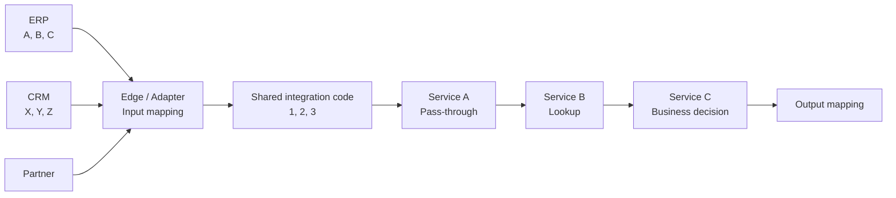
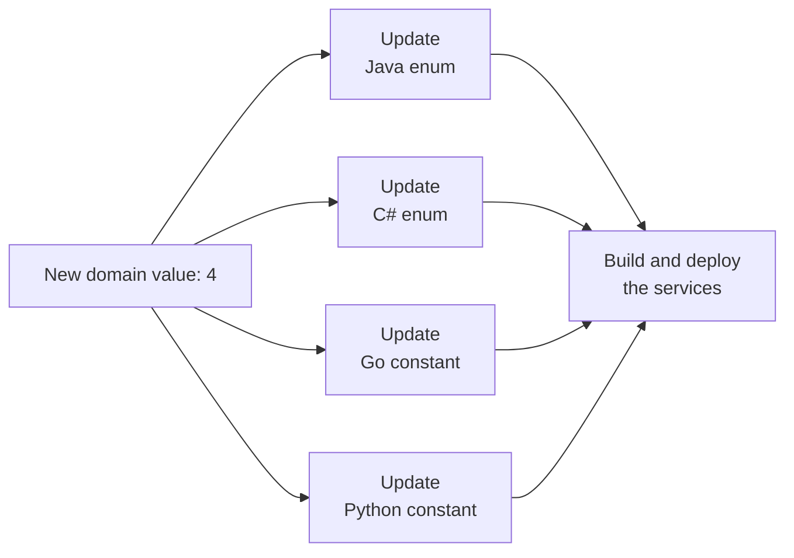

> Separating services is easy. The hard part is making sure that different services understand the same business concept correctly.

Microservices, FaaS, serverless, and event-driven architectures help us build small and independent components. Each component can focus on one task. A service can work within the boundaries and integration contracts of a bounded context. It can use a different programming language and receive data through Kafka, HTTP, a queue, or a database.

This freedom is useful. However, as the system grows, a less visible dependency appears: the **shared business language**.


For example, one system may represent an order status as `A`, another as `X`, and an integration contract as `1`. The systems must agree on the meaning at the integration boundary. This does not mean that every service must use the same domain model. The problem is also larger than choosing between an `enum` and a `string`. It includes ownership, change management, compatibility, and error detection.

This article does not claim that one solution is always correct. Instead, it separates the problem into smaller parts and explains the cost of each option.

## Example Environment

Consider a system with the following properties:

- Services work as small black-box components that receive input and produce output.
- Each component focuses on one task.
- A bounded context can contain one or more services or functions.
- Services can use different programming languages.
- Communication can happen through Kafka, HTTP, queues, or databases.
- Dependencies between services should stay low to avoid creating a distributed monolith.

The simplified flow looks like this:



The first external system uses `A`, `B`, and `C`. The second system uses `X`, `Y`, and `Z` for the same meanings. Our integration contract uses `1`, `2`, and `3`:

| Business meaning | ERP code | CRM code | Shared integration code |
| --- | --- | --- | --- |
| First state | `A` | `X` | `1` |
| Second state | `B` | `Y` | `2` |
| Third state | `C` | `Z` | `3` |

The edge mapping can be stored as configuration instead of application code:

```json
{
  "order-status": {
    "erp": { "A": "1", "B": "2", "C": "3" },
    "crm": { "X": "1", "Y": "2", "Z": "3" }
  }
}
```

The edge layer converts the external value into a shared integration code. Some internal services only pass this code to the next service. Some use it as a database key. Others make business decisions from it or map it to another vocabulary.

When a new value arrives, we want to add only a mapping if the business behavior does not change. We do not want to update and deploy many services that do not interpret its meaning.

Three goals now compete with each other:

1. Add new values without changing application code.
2. Detect spelling and invalid-value errors as early as possible.
3. Avoid a shared runtime dependency for every service.

No single method gives us all three benefits without a cost.

## Three Approaches and Three Different Error Points

We can describe the core problem through three main options.

### 1. Enum: Early Errors but Hidden Deployment Coupling

Defining domain values as enums or constants gives developers strong tooling. An IDE, compiler, or test can detect an incorrect value before the application runs.

```java
public enum OrderStatus {
    APPROVED("1"),
    WAITING("2"),
    REJECTED("3");

    private final String code;

    OrderStatus(String code) {
        this.code = code;
    }
}
```

However, this safety is not free at service boundaries. When a new value is added, teams may need to update many repositories. This can include services that only pass the value or use it as a lookup key. Enums must be changed in different languages, packages must be published, and services must be deployed again.

The services may not import each other directly, but they still depend on the same version of the domain value set. This dependency is not visible as an API call. It becomes visible through a chain of changes and deployments. An enum can protect a closed business rule, but it can also create hidden coupling for an open reference-data set.



### 2. Registry or Database: Central Definition but Runtime Validation

The second option is to store values in Redis, a database, or a shared registry. A new domain value can then be added without changing application code.

However, storing a value in a registry does not guarantee that a developer uses the correct value in application code. In a design where the registry is the runtime validation point, each consumer responsible for validation must add similar query and error-handling logic:

```typescript
async function handle(message: OrderMessage): Promise<void> {
  const exists = await domainRegistry.exists(
    "order-status",
    message.status
  );

  if (!exists) {
    throw new UnknownDomainCode("order-status", message.status);
  }

  await processOrder(message);
}
```

This validation happens at runtime, not at build time. If a service does not perform the check, it remains outside the validation even though the registry exists. In other words, a central registry does not provide system-wide safety by itself. Every required validation point must use it.

This choice can also add query, cache, timeout, retry, and error-handling responsibilities to services. A central registry reduces deployment coupling, but it creates a runtime dependency and extra operational work.

### 3. Open String: No Extra Dependency but Later Errors

The third option is to pass the domain code as an open string. A service that does not understand the value can pass it without changing it. A lookup service can use it directly as a key. A service that interprets the value can validate only the values it supports.

A pass-through service keeps the value unchanged:

```typescript
async function forward(message: OrderMessage): Promise<void> {
  await nextTopic.publish({
    ...message,
    status: message.status
  });
}
```

A lookup service can run its own business lookup without first calling a separate registry:

```typescript
async function findPrice(domainCode: string): Promise<Price> {
  const price = await priceRepository.findByDomainCode(domainCode);

  if (!price) {
    throw new PriceNotConfigured(domainCode);
  }

  return price;
}
```

This approach allows spelling errors. On the other hand, if a new value only needs a mapping or a database row, unrelated services do not need an enum update or a new deployment. It also avoids adding separate registry-validation logic to every service.

When an incorrect code reaches the point where it is needed, the lookup returns no result or the business validation fails. The error does not disappear; it moves from build time to runtime. Code review, tests, safe producer functions, and simple input-format checks can reduce spelling errors.

Whether this is acceptable depends on the effect of the failure. It can be a practical choice when a missing match creates a clear and traceable error. It is not enough when the error silently selects a default, changes authorization, or creates financial loss.

The main differences are:

| Approach | When does the error usually appear? | Main cost |
| --- | --- | --- |
| Enum or constant | During build, testing, or parsing | Changes in many services and deployment coupling |
| Registry or database validation | During runtime validation | Queries, caching, and operational dependency |
| Open string | When a service actually needs the value | Spelling risk and later failure |

The real question is not “Which approach has no errors?” It is: **When can we accept the error, and where can we accept the dependency?**

## String, Free Text, and Domain Code Are Different Concepts

A field with a `string` data type is not always uncontrolled free text. We should separate three different uses:

| Representation | Definition | Example |
| --- | --- | --- |
| Uncontrolled free text | It has no predefined vocabulary or format | A user comment |
| Open domain code | It has a defined format and owner but can accept new values | Carrier or product category code |
| Closed value set | The contract limits the supported values | The states of a workflow |

The shared `1`, `2`, and `3` values in this article are not uncontrolled free text. They are stored as strings, but they belong to a defined domain, namespace, format, and ownership model. The contract also defines what should happen when a value is unknown.

Without this difference, teams may leave critical states uncontrolled because “strings are flexible.” They may also create unnecessary deployment dependencies by using enums for open reference data because “enums are safe.”

## Open and Closed Value Sets

Not every domain value has the same role.

In a **closed set**, a new value means new behavior. For example, an application may start a refund, notification, or accounting action based on a payment result. In this case, a new value is not only configuration. The related service must understand the new behavior.

An **open set** usually contains descriptive reference data. Carrier codes, product categories, and integration-source codes can grow over time. Many services can pass these values or use them as lookup keys without applying special behavior.

A value set does not have to be open or closed for the whole system. The same code can be open for a service that only passes it, but closed for a service that makes a business decision from it.

## What Does DDD Tell Us About This Problem?

Domain-Driven Design does not try to create one universal model for a large system. It recommends a consistent model inside each bounded context. The same concept can have different names, structures, and behavior in different contexts.

For this reason, `1`, `2`, and `3` should not be treated as the “one true domain model” for the whole company. These opaque values are also not an integration language by themselves. Together with the domain name, business meaning, mapping rules, and contract, they can work as transport codes in a published integration language.

In Eric Evans's definition of **Published Language**, the shared language must express the required domain information between contexts and must be well documented. To keep this language practical in a distributed system, we can also expect it to have:

- a clear owner,
- stable naming,
- versioning,
- defined behavior for unknown values.

Expressing the required domain information and documenting it are part of the DDD pattern. Ownership, naming, versioning, and unknown-value policy are operational recommendations in this article. Without them, a shared string can become a hidden dependency instead of a clear integration contract.

Converting `A` or `X` into the shared `1` code can be the job of an adapter or an **Anti-Corruption Layer**. If a bounded context interprets the shared code in a different way, it can convert the code into a local value object, enum, or entity at its boundary. This conversion is needed only in the context that uses the local model, not in every service.

DDD gives us guidance about boundaries, ownership, and relationships between contexts. It does not define one universal mechanism for distributing codes as enums, catalog entries, or strings.

## Passing, Looking Up, and Interpreting a Domain Code

Using a domain field does not always mean understanding its business meaning.

For example, `priceRepository.findByDomainCode` can run the following query:

```sql
SELECT price
FROM domain_prices
WHERE domain_code = :domainCode;
```

This service can find the matching record without knowing what the `1` code means. This is different from making a business decision such as `if (status == APPROVED)`.

A service that makes a business decision can define the values it supports inside its bounded context:

```csharp
public PaymentAction ResolveAction(string status)
{
    return status switch
    {
        "1" => PaymentAction.Capture,
        "2" => PaymentAction.Wait,
        "3" => PaymentAction.Cancel,
        _ => throw new UnsupportedOrderStatus(status)
    };
}
```

It is more useful to group services by their relationship with the value:

| Role | Does it interpret the value? | Code change for a new value | Behavior for an unknown value |
| --- | --- | --- | --- |
| Pass-through | No | Normally not required | Keeps and forwards a valid value |
| Structural user | No | Normally not required | Handles a missing lookup result |
| Semantic user | Yes | Required if new behavior is needed | Validates the supported set |
| Translator | Understands the source and target vocabularies | A mapping change may be enough | Rejects or quarantines missing mappings |

This difference removes the assumption that every service touching the field must update an enum.

### Does a Lookup Service Need an Enum?

If the only goal is to prevent spelling errors, an enum is not always the right tool. An enum prevents a developer from writing `APROVED` instead of `APPROVED` inside the code. It does not stop an external system from sending `"aproved"`. The incoming value still needs parsing or validation.

If the set is open and configurable, an enum creates another cost. Adding a row to a database may be enough, but a service that does not interpret the value must still be compiled and deployed again.

The following protections may be more useful in a lookup service:

- A non-empty `DomainCode` value object that checks the format
- Normalization at the input boundary
- A foreign key or reference-integrity rule when suitable
- A clear result or error type for “record not found”
- Logs with the code, domain name, source, and correlation ID
- Tests for known, unknown, and invalid values

For example, a value object can protect the general format without closing the value set:

```typescript
class DomainCode {
  private constructor(readonly value: string) {}

  static parse(raw: string): DomainCode {
    const normalized = raw.trim().toUpperCase();

    if (!/^[A-Z0-9_-]{1,32}$/.test(normalized)) {
      throw new InvalidDomainCode(raw);
    }

    return new DomainCode(normalized);
  }
}
```

A spelling error may appear at runtime as “record not found.” Whether this is acceptable depends on the context. An enum may be unnecessary when a missing record is a normal business result. The error should be stopped at the producer or input boundary when it can cause financial loss, incorrect authorization, or silent data loss.

## Other Possible Methods

### Shared Library or Generated Code

Domain definitions can be stored in one package, or a central schema can generate code for different languages. This reduces manual duplication and improves serialization consistency.

However, each language still needs a package-publishing process. Services must receive the new package version and may still need another deployment. If the shared package starts to contain business logic, it creates strong coupling between services.

### Schema and Contract Management

Avro, Protobuf, JSON Schema, and OpenAPI make message structures and compatibility rules visible. A Schema Registry and CI checks can show the effect of structural changes on consumers at an early stage.

However, schema compatibility is not the same as business-meaning compatibility. A field can exist and have the correct string type while the consumer still does not understand the new value. Closing the value set with an enum in the schema also brings back the problem of older consumers receiving a new value.

## How Can We Find the Source of an Error?

Dynamic codes do not require every service to keep a full domain-history table. A message or trace can carry a small amount of useful context:

```json
{
  "correlationId": "flow-456",
  "domain": "order-status",
  "value": "approved",
  "mappingVersion": "2026-07-04",
  "producer": "edge-order-adapter"
}
```

If a service does not change the value, it does not need to create a separate audit record. When it changes the value, it can record the old value, new value, reason, service, and mapping version as an audit event or trace attribute.

This approach does not prevent the error, but it makes it easier to find where the value was created or changed.

## A Practical Hybrid Model

The following model can be a starting point for the example system:

1. Convert external values into a shared integration code at the edge or anti-corruption layer.
2. Treat the shared code as an integration language between contexts, not as the domain model of the whole system.
3. Classify value sets as open reference sets or closed behavior sets.
4. Use enums or similar local types only in services that make business decisions from closed sets.
5. Pass open sets as shared string codes. A catalog can support management, but it does not have to become a synchronous runtime dependency for every service.
6. Allow pass-through and lookup services to forward or query well-formed unknown values without a code change.
7. Define the behavior for unknown values in every contract: reject, pass, use a default, or quarantine.
8. Version mapping changes and make the active mapping version traceable.
9. Run schema compatibility and consumer contract tests in CI/CD.

This model also has a cost. It needs contract management, possible catalog or cache distribution, and observability. However, it keeps most of the complexity at the boundaries where the domain value is actually interpreted instead of adding the same complexity to every service.

## Why Is There No Perfect Answer?

DDD explains model boundaries, ownership, and relationships between contexts. Schema tools check structural compatibility. Registries and catalogs support dynamic management. Enums help services use known values safely. Open string codes reduce change and deployment coupling.

None of these options gives us all of the following without a cost:

- compile-time safety,
- extension without code changes,
- central consistency,
- runtime independence.

This does not mean that the problem cannot be solved. Different methods work in different situations. However, in the sources and real systems I have studied, I have not found an approach that removes every cost from domain-code management in a multilingual, distributed service chain. Enums, registries, and open strings each provide one kind of safety while creating a cost somewhere else.

Before choosing a method, we should answer these questions:

- Which bounded context owns the value?
- Does a new value change system behavior?
- Does the service interpret the value, use it as a lookup key, or only pass it?
- What is the safe behavior for an unknown value?
- Can a mapping change alter the meaning of old events?
- Can we trace the source value and mapping version?
- Can the flow continue when the central catalog is not available?

Choosing an enum, database, or Schema Registry before answering these questions often moves the problem to another layer instead of solving it.

## Conclusion

The main problem in distributed domain management is not where values are stored. The real problem is **how the contract evolves between the owner of the business meaning and the services that pass, look up, translate, or interpret it**.

Passing a domain code, using it as a lookup key, and interpreting its business meaning are different actions. The required safety should depend on the service's relationship with the value.

An enum finds many errors early, but it can create change and deployment coupling between services that share the value set. A registry provides central validation, but it moves the check to runtime and adds infrastructure work. An open string accepts spelling risk, but it prevents changes in unrelated services and shows the error when a service actually needs the value.

A contract-based string code can therefore be a practical option for low-risk, open value sets when the flow can stop safely after a missing match. Code review and tests reduce spelling risk. Clear errors, logs, and tracing make runtime problems visible. For critical business decisions, the related bounded context should validate the values it supports instead of depending only on an indirect runtime failure.

The right question is therefore not:

> “Should the domain value be an enum or a string?”

It is:

> **“Who owns this value, which services really interpret it, and what does the contract say when the value is unknown?”**

Independence in a distributed system does not mean that services share no information. It means that the boundaries, owner, version, and change process of shared information are clear.

At least in the sources and systems I have studied, there is still no method that solves this balance completely and without cost. Every method provides one kind of safety and brings a trade-off. For this reason, each system must decide where domain codes are open or closed and at which boundary an invalid value should stop.

## Further Reading

- [Martin Fowler — Bounded Context](https://martinfowler.com/bliki/BoundedContext.html)
- [Eric Evans — Domain-Driven Design Reference](https://www.domainlanguage.com/wp-content/uploads/2016/05/DDD_Reference_2015-03.pdf)
- [Microsoft — Designing a microservice domain model](https://learn.microsoft.com/dotnet/architecture/microservices/microservice-ddd-cqrs-patterns/microservice-domain-model)
- [Microsoft — Identifying domain-model boundaries for each microservice](https://learn.microsoft.com/dotnet/architecture/microservices/architect-microservice-container-applications/identify-microservice-domain-model-boundaries)
- [Laigner et al. — Data Management in Microservices: State of the Practice, Challenges, and Research Directions](https://arxiv.org/abs/2103.00170)
- Eric Evans — *Domain-Driven Design: Tackling Complexity in the Heart of Software*
- Vaughn Vernon — *Implementing Domain-Driven Design*
