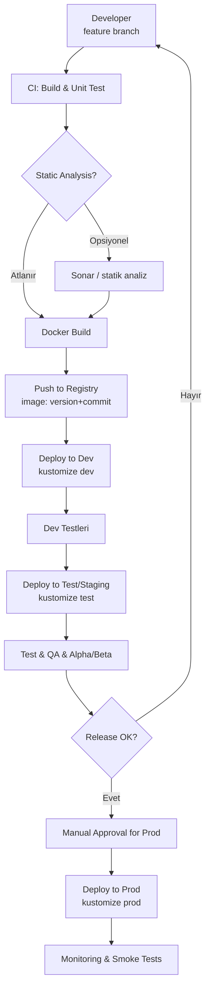
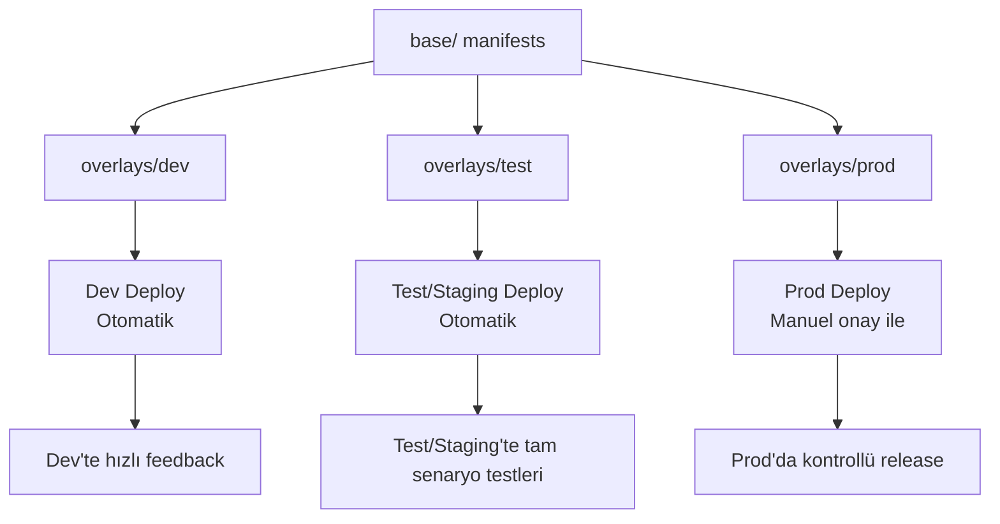

# Versioning and Releasing Management on Kubernetes

*A simple roadmap for small or medium-sized, uncrowded teams*

This article; It offers a simple approach to code development, versioning, container build processes and release management on Kubernetes.  
The steps here must be **customized** according to team size, culture, technical environment, product or regulations; should be viewed as a practical beginner's guide, not strict rules.

## 1. General Principles

- Git should always be the single source of truth (**Single Source of Truth**).
- Code, Kubernetes YAML files, kustomize templates and configurations are versioned on Git.
- Container tags are managed with the **SemVer + build number / commit hash** model.
- Automation is kept high in Dev and Test/Staging environments, while there is always a manual control layer in the Prod environment.
- Avoiding complex tool sets and keeping processes simple in small teams increases sustainability.

## 2. Phase 1 – Code Release Process

### 2.1. Branching Model

- **main:** Only stable code going to prod.
- **dev:** Integrated code to test.
- **feature/\***: New feature development branches.
- **hotfix/\***: Quick fixes for prod environment errors.

### 2.2. Code Development and Release Flow

1. **Feature branch is created.**
2. The code is developed and progress is made with small and meaningful commit messages.
3. **Static analysis (SonarQube etc.) – can be considered optional.**
4. Unit tests are run.
5. README is updated:
   - How to run the service
   - Upgrade steps
   - Required environment variables and configuration information
6. Container is built and versioning is done. For example:
   - `1.3.0-45`
   - `1.3.0-a82d9f1b`
7. The built image is pushed to the registry.
8. Pull Request is created for `feature/*` → `dev` and merged after code review.
9. When the release decision is made, `dev` → `main` is merged and a tag is created:
   - `v1.3.0`

## 3. Phase 2 – Version Release Process (Kubernetes)

### 3.1. Deploy in Testing / Staging Environment

1. The image tag is updated in the Test/Staging overlay or manifest file.
2. Pipeline is triggered and deployed to Kubernetes.
3. Security, performance and functional tests are applied.
4. If necessary, alpha/beta user tests are carried out.

### 3.2. Fix Flow in Case of Error

```mermaid
flowchart TD
    A[Bug tespit] --> B[Issue aç]
    B --> C{Kritiklik?}
    C -->|Kritik| D[hotfix branch]
    C -->|Normal| E[feature veya mevcut branch]
    D --> F[Fix geliştir]
    E --> F
    F --> G[CI: test + build]
    G --> H[Container push]
    H --> I[Test/Staging deploy]
    I --> J[Regression test]
    J --> K{Çözüldü mü?}
    K -->|Evet| L[Prod release adayı]
    K -->|Hayır| B
````

The fixed version can also be applied to other relevant feature branches (for example, with `cherry-pick`) if necessary.

### 3.3. Clean Installation and Upgrade Tests

* The new version is first installed and tested from scratch on a **clean namespace**.
* Then the **upgrade scenario** from the previous stable version is run; data migrations and backward compatibility are checked.

### 3.4. Prod Release

1. The image tag is updated in the product manifests.
2. Automatic deployment does not work in the Prod environment; There is a manual “review & approve” layer.
3. DevOps / Platform Engineer checks the diff and configuration changes.
4. After approval, deployment is done.
5. Necessary migrations are applied, health check and smoke tests are run.
6. Release is completed and monitored.

## 4. Configuration Management and Kubernetes YAML Structure

In this model, the **customized + pure YAML** approach is mostly preferred instead of Helm.

Recommended directory structure:

```text
k8s/
  service-name/
    base/
    overlays/
      dev/
      test/
      prod/
```

* Common definitions are kept under `base/`.
* Environment-based differences are managed in `overlays/*` folders.
* In staging environments, processes can be fully automated.
* Nothing in the prod environment is implemented completely automatically; There is definitely a manual review layer.

## 5. Team Roles and Responsibilities

### Product Owner

* Determines use-cases and stories.
* Creates sprint plans and release calendar.
* Determines technical scope and priorities together with the Architect.

### Tech Lead / Architect* Determines technical design and architecture.
* Defines service boundaries, integration models and data flow.
* It outlines how to handle technical issues.
* Participates in code review processes when necessary.
* Creates versioning, release and technical quality standards.

### DevOps / Platform Engineer

* Manages Kubernetes environments.
* Manages YAML/kustomize configurations and environment versioning.
* Establishes and maintains CI/CD pipelines.
* Manages security, secret management, monitoring and logging infrastructures.
* Executes the manual **review & apply** process in the production environment.

These roles can be combined or separated based on team capabilities. In small teams, some roles may be held by the same person; The important thing is that responsibilities are clear.

## 6. General Summary

* The code is developed in feature branches and PRed to the `dev` branch.
* Unit test + build + optional static analysis is run.
* Container is built; It is sent to the registry with **SemVer + build/commit tag**.
* Deployment is made automatically to staging environments and manually to production environments.
* Kustomize/pure YAML is versioned via Git and managed on an environment basis.
* The release process is always verified by clean installation + upgrade tests.
* The entire process is designed to be simple but flexible according to the team culture and environment.

## Appendix A – Sample CI/CD Pipeline Template

The example below is a generic template for a Jenkins/Jenkins-X like environment.

* Build + test
* (Optional) static analysis
* Docker build & push
* Dev → Test auto
* Manual approval for prod

```groovy
pipeline {
    agent any

    environment {
        REGISTRY      = 'registry.example.com'
        APP_NAME      = 'invoice-service'
        VERSION       = '1.3.0'                // Manuel/otomatik set edilebilir
        GIT_COMMIT_ID = "${env.GIT_COMMIT}"    // Jenkins otomatik doldurur
        IMAGE_TAG     = "${VERSION}-${GIT_COMMIT_ID.take(8)}"
        IMAGE         = "${REGISTRY}/${APP_NAME}:${IMAGE_TAG}"
        K8S_DIR       = 'k8s/invoice-service'
        RUN_SONAR     = 'false'               // İhtiyaca göre true/false
    }

    stages {
        stage('Checkout') {
            steps {
                checkout scm
            }
        }

        stage('Build & Unit Tests') {
            steps {
                sh """
                  ./gradlew clean test       // kendi build komutunla değiştir
                """
            }
        }

        stage('Static Analysis (optional)') {
            when {
                expression { env.RUN_SONAR == 'true' }
            }
            steps {
                sh """
                  ./gradlew sonarqube       // örnek Sonar taraması
                """
            }
        }

        stage('Docker Build & Push') {
            steps {
                sh """
                  docker build -t ${IMAGE} .
                  docker push ${IMAGE}
                """
            }
        }

        stage('Deploy to Dev') {
            steps {
                sh """
                  cd ${K8S_DIR}/overlays/dev
                  kustomize edit set image ${REGISTRY}/${APP_NAME}=${IMAGE}
                  kustomize build . | kubectl apply -f -
                """
            }
        }

        stage('Deploy to Test') {
            steps {
                sh """
                  cd ${K8S_DIR}/overlays/test
                  kustomize edit set image ${REGISTRY}/${APP_NAME}=${IMAGE}
                  kustomize build . | kubectl apply -f -
                """
            }
        }

        stage('Manual Approval for Prod') {
            steps {
                script {
                    timeout(time: 1, unit: 'HOURS') {
                        input message: "Prod ortamına ${IMAGE_TAG} versiyonunu deploy etmek istiyor musun?"
                    }
                }
            }
        }

        stage('Deploy to Prod') {
            steps {
                sh """
                  cd ${K8S_DIR}/overlays/prod
                  kustomize edit set image ${REGISTRY}/${APP_NAME}=${IMAGE}
                  kustomize build . | kubectl apply -f -
                """
            }
        }
    }
}
```

> Use your own build commands instead of `./gradlew`, `kubectl kustomize` instead of `kustomize`, etc. You can use commands.

## Appendix B – Sample Customized Template Set

### Syntax Structure

```text
k8s/
  invoice-service/
    base/
      deployment.yaml
      service.yaml
      kustomization.yaml
    overlays/
      dev/
        kustomization.yaml
        configmap-dev.yaml
      test/
        kustomization.yaml
        configmap-test.yaml
      prod/
        kustomization.yaml
        configmap-prod.yaml
        hpa-prod.yaml
```

### 1. `base/kustomization.yaml`

```yaml
apiVersion: kustomize.config.k8s.io/v1beta1
kind: Kustomization

resources:
  - deployment.yaml
  - service.yaml
```

### 2. `base/deployment.yaml`

```yaml
apiVersion: apps/v1
kind: Deployment
metadata:
  name: invoice-service
  labels:
    app: invoice-service
spec:
  replicas: 2
  selector:
    matchLabels:
      app: invoice-service
  template:
    metadata:
      labels:
        app: invoice-service
    spec:
      containers:
        - name: invoice-service
          image: registry.example.com/invoice-service:latest   # overlay ile override edilecek
          ports:
            - containerPort: 8080
          env:
            - name: LOG_LEVEL
              value: "Info"
          readinessProbe:
            httpGet:
              path: /health
              port: 8080
            initialDelaySeconds: 5
            periodSeconds: 10
          livenessProbe:
            httpGet:
              path: /health
              port: 8080
            initialDelaySeconds: 15
            periodSeconds: 20
```

### 3. `base/service.yaml`

```yaml
apiVersion: v1
kind: Service
metadata:
  name: invoice-service
  labels:
    app: invoice-service
spec:
  selector:
    app: invoice-service
  ports:
    - port: 80
      targetPort: 8080
      protocol: TCP
      name: http
  type: ClusterIP
```

### 4. `overlays/dev/kustomization.yaml`

```yaml
apiVersion: kustomize.config.k8s.io/v1beta1
kind: Kustomization

resources:
  - ../../base

images:
  - name: registry.example.com/invoice-service
    newTag: dev-latest   # Pipeline burada gerçek tag ile override edecek

configMapGenerator:
  - name: invoice-service-config-dev
    behavior: merge
    literals:
      - LOG_LEVEL=Debug
      - FEATURE_FLAG_EXPERIMENTAL=true
```

### 5. `overlays/dev/configmap-dev.yaml` (optional)

```yaml
apiVersion: v1
kind: ConfigMap
metadata:
  name: invoice-service-extra-dev
data:
  SAMPLE_KEY: "dev-only-value"
```

### 6. `overlays/test/kustomization.yaml`

```yaml
apiVersion: kustomize.config.k8s.io/v1beta1
kind: Kustomization

resources:
  - ../../base

images:
  - name: registry.example.com/invoice-service
    newTag: test-latest

configMapGenerator:
  - name: invoice-service-config-test
    behavior: merge
    literals:
      - LOG_LEVEL=Info
      - FEATURE_FLAG_EXPERIMENTAL=false
```

### 7. `overlays/prod/kustomization.yaml`

```yaml
apiVersion: kustomize.config.k8s.io/v1beta1
kind: Kustomization

resources:
  - ../../base
  - hpa-prod.yaml

images:
  - name: registry.example.com/invoice-service
    newTag: 1.3.0-PLACEHOLDER   # Pipeline burayı gerçek tag ile değiştirecek

configMapGenerator:
  - name: invoice-service-config-prod
    behavior: merge
    literals:
      - LOG_LEVEL=Warning
      - FEATURE_FLAG_EXPERIMENTAL=false

patchesStrategicMerge:
  # Gerekirse prod'a özel patch dosyaları eklenebilir
  # - deployment-prod-patch.yaml
```

### 8. `overlays/prod/configmap-prod.yaml` (optional)

```yaml
apiVersion: v1
kind: ConfigMap
metadata:
  name: invoice-service-extra-prod
data:
  SAMPLE_KEY: "prod-only-value"
```

### 9. `overlays/prod/hpa-prod.yaml`

```yaml
apiVersion: autoscaling/v2
kind: HorizontalPodAutoscaler
metadata:
  name: invoice-service-hpa
spec:
  scaleTargetRef:
    apiVersion: apps/v1
    kind: Deployment
    name: invoice-service
  minReplicas: 2
  maxReplicas: 10
  metrics:
    - type: Resource
      resource:
        name: cpu
        target:
          type: Utilization
          averageUtilization: 70
```

## Appendix C – Flow Diagrams (Mermaid)

### C.1. End-to-End Version & Release Flow



### C.2. Config / YAML Promotion Flow


