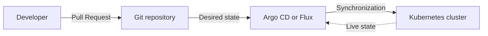
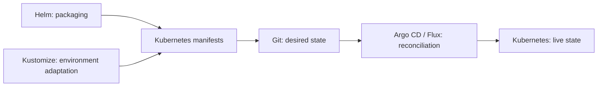

Soon after learning Kubernetes, we encounter another set of terms: YAML manifests, Helm Charts, Kustomize, GitOps, Argo CD, and Flux. Each solves a different problem, but learning them in isolation can make their relationship harder to see.

The goal of this article is not to turn every command into a tutorial. It is to build a useful mental model: what Kubernetes runs, what Helm packages, what Kustomize customizes, and how GitOps changes the way the resulting configuration reaches a cluster.

## Start with the Core Problem: What Does Kubernetes Do?

Kubernetes is an orchestration platform for running and managing containerized applications. We can describe how many copies of an application should run, how it should be reached, which configuration it should use, and how it should recover when a process fails.

We usually express this desired state through YAML manifests:

```yaml
apiVersion: apps/v1
kind: Deployment
metadata:
  name: orders-api
spec:
  replicas: 2
  selector:
    matchLabels:
      app: orders-api
  template:
    metadata:
      labels:
        app: orders-api
    spec:
      containers:
        - name: orders-api
          image: registry.example.com/orders-api:1.4.0
          ports:
            - containerPort: 8080
```

This file tells Kubernetes to run two Pods from the `orders-api:1.4.0` image and expose port 8080 inside the container.

Kubernetes runs the workload and continuously tries to preserve that declared state. It does not, by itself, decide how our team should package a group of manifests, remove duplication between environments, review a production change, or synchronize a Git repository with a cluster. Those responsibilities belong to other layers.

## What Happens as the Number of Manifests Grows?

A real application rarely consists of one `Deployment`. Over time, it may also need:

- Services
- ConfigMaps
- Secret references
- Ingress or Gateway resources
- HorizontalPodAutoscalers
- ServiceAccounts and RBAC rules
- NetworkPolicies
- environment-specific replicas and resource limits

Development, test, and production then introduce small but important differences. Development may need one replica while production needs four. Domains, image tags, resource limits, and integrations can also vary.

Copying every YAML file into an environment directory works at first, but each copy becomes another configuration that can drift. Helm and Kustomize approach this management problem from different directions.

## What Is Helm?

Helm is commonly described as a package manager for Kubernetes. It turns the Kubernetes resources needed by an application into a reusable and versioned package called a **Chart**.

A small Chart usually looks like this:

```text
orders-api/
├── Chart.yaml
├── values.yaml
└── templates/
    ├── deployment.yaml
    ├── service.yaml
    └── ingress.yaml
```

- `Chart.yaml` contains package metadata such as its name and version.
- `values.yaml` defines configurable defaults.
- `templates/` contains Kubernetes manifest templates that consume those values.

The replica count and container image, for example, can be placed in `values.yaml`:

```yaml
replicaCount: 2

image:
  repository: registry.example.com/orders-api
  tag: "1.4.0"
```

The Deployment template refers to them:


```yaml
spec:
  replicas: {{ .Values.replicaCount }}
  template:
    spec:
      containers:
        - name: orders-api
          image: "{{ .Values.image.repository }}:{{ .Values.image.tag }}"
```


The same Chart can now be installed with a different values file for each environment:

```bash
helm upgrade --install orders-api ./orders-api \
  --values values-prod.yaml
```

Helm is particularly useful when:

- the same application must be installed for several customers or clusters,
- the package needs an independent version and distribution lifecycle,
- users need to configure many supported options,
- an existing product such as PostgreSQL, Prometheus, or cert-manager is distributed as a Chart,
- Charts will be shared through a repository or OCI registry.

There is a cost to this flexibility. As conditions and parameters accumulate, a Chart can become harder to understand than the manifests it generates. Kubernetes YAML gradually turns into a program written in a template language. Making every field configurable is therefore not a sign of good Chart design.

## What Is Kustomize?

Kustomize customizes Kubernetes YAML without requiring placeholders or a template language. Its typical model keeps shared resources in a **base** and applies environment-specific changes through **overlays**.

```text
k8s/
├── base/
│   ├── deployment.yaml
│   ├── service.yaml
│   └── kustomization.yaml
└── overlays/
    ├── dev/
    │   └── kustomization.yaml
    └── prod/
        └── kustomization.yaml
```

The base contains the common definition. A production overlay describes only what differs:

```yaml
apiVersion: kustomize.config.k8s.io/v1beta1
kind: Kustomization

resources:
  - ../../base

images:
  - name: registry.example.com/orders-api
    newTag: 1.4.0

replicas:
  - name: orders-api
    count: 4
```

We can inspect the generated manifests with:

```bash
kubectl kustomize k8s/overlays/prod
```

And apply them with:

```bash
kubectl apply -k k8s/overlays/prod
```

Kustomize is a good fit when:

- environments have a small set of explicit differences,
- we want the source to remain recognizable as ordinary Kubernetes YAML,
- dev, test, and production derive from one shared base,
- patch-based customization is enough,
- using the Kustomize support built into `kubectl` is useful.

Kustomize is not a package manager. It does not provide a Chart repository, Chart dependencies, or the same release abstraction that Helm provides. Its primary job is composing and customizing resources.

## Helm or Kustomize?

The question often assumes that one tool must replace the other. Their strongest use cases, however, are not identical.

| Requirement | Helm | Kustomize |
|---|---|---|
| Package an application | Strong fit | Not its purpose |
| Expose many supported parameters | Strong fit | Better for limited variation |
| Manage environment differences | Values files | Bases and overlays |
| Keep source manifests directly readable | Templates add indirection | Usually easier |
| Package versions and dependencies | Supported | Not supported |
| Built into `kubectl` | Separate CLI | Supported by `kubectl` |

A practical rule is:

- Use Helm when the output is a reusable, distributable application package.
- Use Kustomize when you own the manifests and mainly need a small number of environment variations.
- Combine them when a packaged application still needs controlled, site-specific adjustments.

The right choice depends less on tool popularity than on the kind of variability we need to manage.

## What Is GitOps?

Helm and Kustomize produce or customize manifests. GitOps is an operating model for managing the desired state represented by those manifests.

In a GitOps workflow, a Git repository is the source of truth for the system's intended configuration. Instead of connecting to production and running a command directly, a developer or platform engineer proposes a Git change. The change can be reviewed and approved before a controller applies it to the cluster.



Git is no longer just storage for YAML files. It becomes the versioned record of the desired operational state.

## What Do Argo CD and Flux Do?

Argo CD and Flux are widely used controllers for implementing GitOps on Kubernetes. They observe a source, generate or read the desired manifests, compare them with the live cluster, and report the difference. Depending on policy, they can also correct that difference automatically.

If Git declares four replicas but someone manually changes the live Deployment to two, the controller detects the drift. With automated synchronization or self-healing enabled, it can restore the Git-defined state.

This continuous comparison and correction is a **reconciliation loop**. It is more important than the presence of a Git repository alone; storing manifests in Git but deploying them through untracked manual commands does not give us the same operating model.

GitOps can provide:

- Pull Request review for operational changes,
- an audit trail of who changed what and when,
- detection of manual configuration drift,
- reproducible environment definitions,
- rollback by restoring a known Git revision,
- reduced need to distribute cluster credentials to developer machines or CI jobs.

It does not make an unsafe configuration safe. A bad manifest merged into Git can still be delivered very efficiently. Secret management, tests, approvals, access control, rollout health, and recovery policies remain separate design concerns.

## How Is GitOps Different from CI/CD?

In a traditional CI/CD pipeline, the pipeline builds the application, pushes a container image, and often deploys directly to Kubernetes. The pipeline therefore needs credentials that allow it to change the cluster.

A GitOps design can separate these responsibilities:

1. CI tests the source code.
2. CI builds the container image and pushes it to a registry.
3. The image tag in the deployment repository is updated.
4. Argo CD or Flux detects the new desired state.
5. The controller reconciles the cluster with that state.

CI still exists, but it no longer has to perform the deployment itself. It produces an artifact and records the requested version in Git; a controller operating near or inside the cluster pulls and applies the change. This is why GitOps is often described as a pull-based delivery model.

## How Do These Layers Work Together?

We can position the tools in one flow:



A project might use that model as follows:

1. Application source code lives in its own Git repository.
2. CI tests the code and publishes `orders-api:1.4.0`.
3. The application is packaged as a Helm Chart.
4. Environment-specific values or Kustomize overlays live in a deployment repository.
5. A Pull Request updates the production image tag to `1.4.0`.
6. Argo CD detects the change and synchronizes the cluster.
7. The team observes rollout health through Argo CD and its monitoring stack.

This is an example, not a mandatory repository layout. A small team may not benefit from separating application and deployment repositories. A larger or regulated organization may need that boundary for access control, approval, and auditability.

## Does Every Project Need All of Them?

No. Adding tools is not the same as increasing maturity.

A small application may be well served by a few clear YAML files and `kubectl apply`. Kustomize becomes useful when environment differences appear. Helm becomes valuable when the application needs to be packaged and reused. GitOps starts to pay for itself as the number of applications, environments, teams, and audit requirements grows.

| Scenario | Reasonable starting point |
|---|---|
| One application, one environment, few resources | Plain Kubernetes YAML |
| One application, several environments, small differences | Kustomize |
| Reusable or externally distributed application | Helm Chart |
| Many applications and environments with auditable delivery | GitOps with Argo CD or Flux |
| Packaging and site-specific customization both matter | Helm + Kustomize + GitOps |

This table is not a universal prescription. Team experience, security requirements, operational load, and the ownership model can change the decision.

## Common Mistakes

Several mistakes appear repeatedly across these tools:

- copying all YAML files for every environment,
- turning every Helm field into a parameter,
- using Kustomize overlays that replace so much of the base that the base has little meaning,
- adopting GitOps while keeping routine manual cluster changes,
- deploying mutable tags such as `latest`,
- storing unencrypted secret values in Git,
- applying generated manifests without rendering and validating them first,
- losing the traceable link between a Git change and the running image,
- enabling automatic synchronization before defining health checks and recovery behavior.

Regardless of the tools, the generated configuration should remain understandable, each change should be traceable, and a running version should be reproducible.

## Conclusion

Kubernetes, Helm, Kustomize, and GitOps are not competing answers to one question. They operate at different layers of the delivery process.

Kubernetes runs the application. Helm packages its resources. Kustomize adapts manifests to an environment. Git records the intended state. Argo CD or Flux continuously reconciles that state with the cluster.

We do not need to introduce every layer on day one. We first need to identify where the current complexity lives: packaging, environment variation, review and audit, or the gap between Git and the live cluster. The useful tool is the one that reduces that specific complexity without creating a larger operational burden elsewhere.

## Further Reading

- [Kubernetes — Declarative Management with Kustomize](https://kubernetes.io/docs/tasks/manage-kubernetes-objects/kustomization/)
- [Helm — Introduction to Helm](https://helm.sh/docs/intro/introduction/)
- [Argo CD — Declarative GitOps CD for Kubernetes](https://argo-cd.readthedocs.io/en/stable/)
- [Argo CD — Automation from CI Pipelines](https://argo-cd.readthedocs.io/en/latest/user-guide/ci_automation/)
- [Rendering and Managing Helm Charts Locally]()
- [Versioning and Release Management on Kubernetes]()
