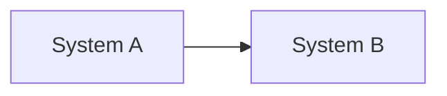
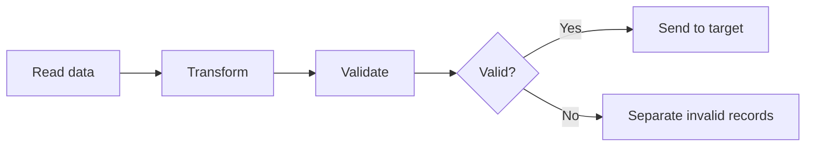
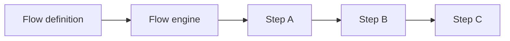
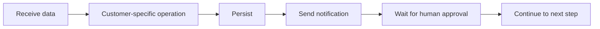
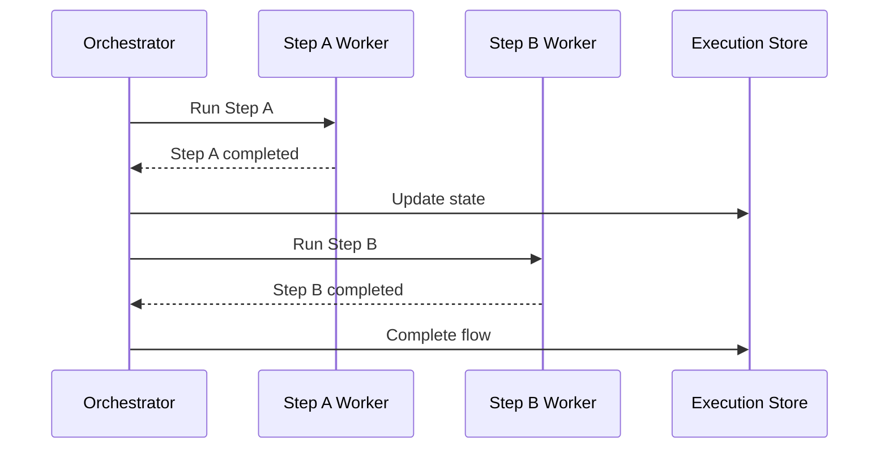
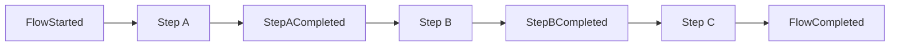
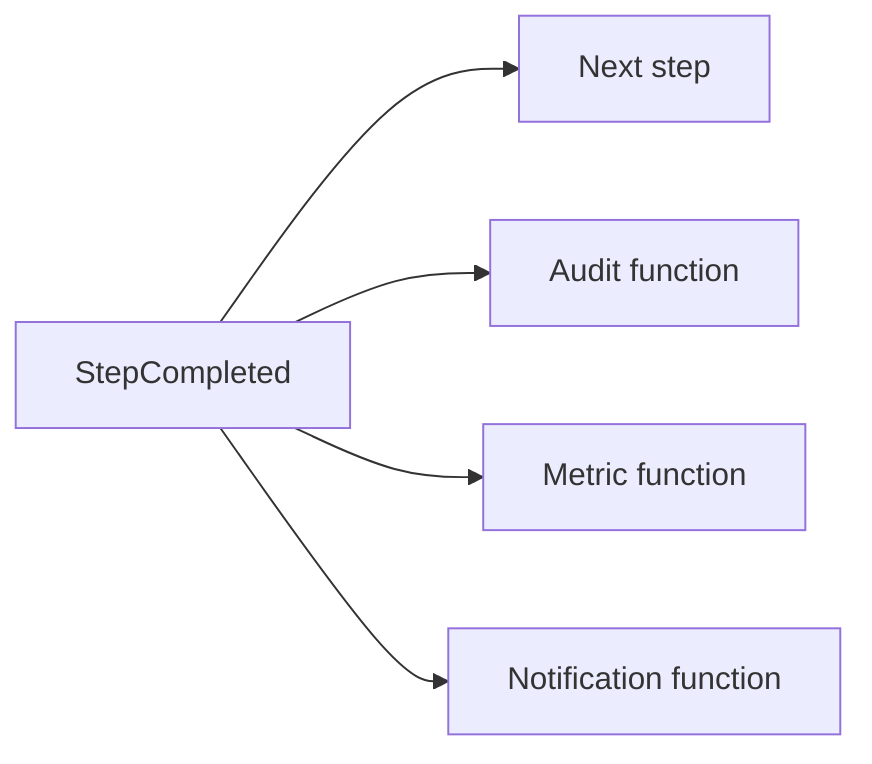
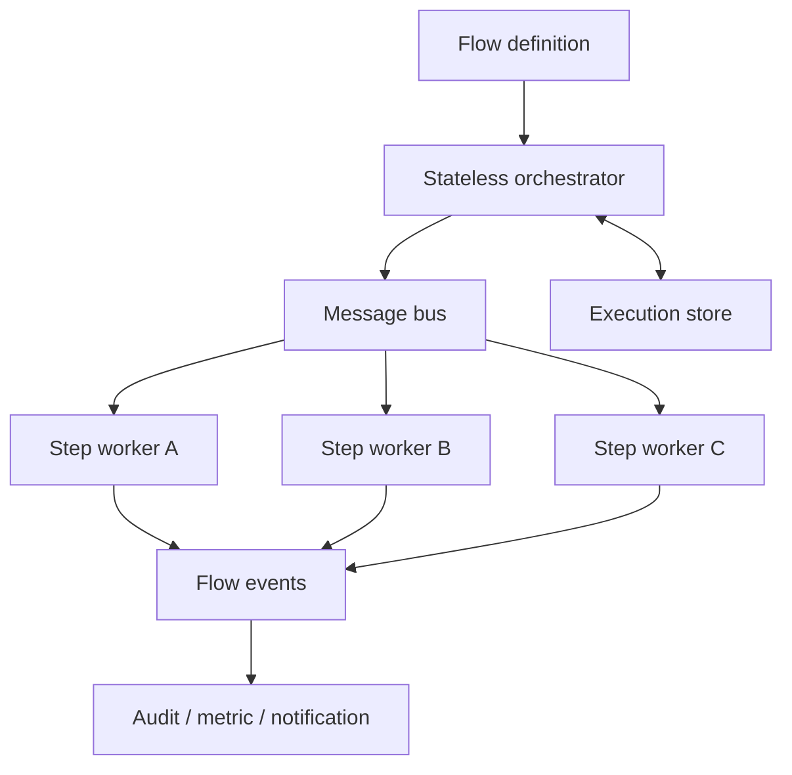

A simple requirement to move data from one system to another can turn into a flow engine problem as transformation, validation, notification, and runtime configuration enter the picture. This article follows that change step by step and examines where ready-made tools end and a custom execution model begins.

## What Is a Flow?

Imagine that we are building a project whose purpose is to move data from System A to System B:



At this stage, we are dealing mainly with a **data integration** or **data pipeline** problem. Tools such as Logstash, Azure Data Factory, and Apache NiFi can read data from different sources and move it to target systems. Nothing here requires us to build a custom flow engine.

In real projects, however, data is rarely moved without any intermediate work. Its format may need to be transformed, required fields must be validated, and invalid records have to be separated:



We are no longer describing only where the data comes from and where it goes. We are also defining the steps it passes through and the conditions that control its route. A flow is a structure that describes the steps of a process, the transitions between those steps, and the paths to follow for different outcomes.

## When Do We Need a Flow?

Not every sequence of operations needs a separate flow infrastructure. If the steps are few, stable, and changed only by developers, the process can remain in ordinary application code:

```text
Read → Validate → Transform → Save
```

This is still a flow, but its definition is embedded in the codebase. Adding a step or changing the order requires a code change, testing, and another deployment. In this article, I will refer to this as a **static flow**.

A flow begins to emerge as a separate concern when the number of steps grows, conditional paths appear, failed work must be retried, or operators need to see the current stage of a process. The number of steps alone is not the deciding factor. A three-step process that waits two days for human approval may need stronger flow management than a short operation containing twenty consecutive method calls.

The need becomes clearer when we want to manage process state and failure paths independently of a single application call. Common signs include the following:

- The process lasts longer than a single HTTP request or application process
- It waits for an external event, timer, or human decision
- It must continue from the failed step instead of starting again
- Operators need to see the current step of each instance
- The same process follows different paths for different customers or conditions

None of these signs alone requires a custom engine. They help us distinguish between a flow that can stay in code, one that fits an existing execution tool, and one whose behavior has become a product concern.

## What Is a Flow Engine?

A flow engine is the execution layer that decides which step of a defined flow should run and when. It reads the flow definition and determines the starting step, the next transition, and the completion condition. Depending on the requirements, it may also manage retries, timeouts, waits, parallel work, and execution state.



When we need to run many flows, recover after failure, or track long-running processes, collecting these responsibilities in an execution layer can be easier to reason about than distributing them throughout the application code.

## What Do Ready-Made Flow Tools Do?

Once a flow need appears, several options become available: code-based solutions, existing engines, managed services, and custom development. Mature tools already exist for different kinds of problems, but they do not all solve the same type of flow.

| Tool | Main use | Execution approach |
| --- | --- | --- |
| Logstash | Log and event pipelines | Input, filter, and output chain |
| Azure Data Factory | Data movement and ETL/ELT | Managed pipelines and activities |
| Apache NiFi | Visual dataflow and system-to-system transfer | Processors, connections, and queues |
| Apache Airflow | Scheduled data and batch orchestration | Code-defined DAGs and tasks |
| AWS Step Functions | Application and service orchestration | State machines and managed executions |

NiFi combines routing, transformation, queuing, back pressure, and data provenance for dataflows. I covered this model in more detail in [Data Flow Automation with Apache NiFi]().

Airflow represents work as tasks and dependencies in a DAG. Features such as schedules and backfills make it particularly useful for data pipelines. Step Functions uses state machines to run AWS services, Lambda functions, and external work within ordered and conditional application workflows.

These tools do more than connect boxes. They provide capabilities such as scheduling, retry handling, state tracking, execution history, and operational views, all of which are expensive to build and maintain. The question from [Should I Write Everything Myself? On Using External Tools Properly]() also applies here: does this infrastructure problem belong to our product, or has another team already spent years solving it?

## Where Do Ready-Made Tools Start to Struggle?

Let us extend the example. The flow no longer transforms data and sends it directly to a destination:



As nodes begin to contain product-specific behavior, the distance between our product model and the tool's native model grows. NiFi, for example, includes processors that can run scripts, and compiled custom extensions can also be developed. However, placing core business rules in many scripts or tool-specific extensions can make testing, dependency management, CI/CD, and versioning harder than they are in a normal application codebase.

Airflow tasks can also execute custom code. Its main model, however, is closer to running workflows defined by developers than to serving as a general-purpose low-code product where end users add and remove nodes at runtime. If each new feature requires another adapter, plugin, or workaround, the tool may begin shaping the product model instead of reducing the problem.

There is also a reason why many flow tools use their own queue and state structures instead of, or alongside, Kafka and RabbitMQ. A message broker transports messages. A flow engine must additionally know which step is expected, which step has completed, how many retries have occurred, when a timeout expires, which flow version is running, and what the execution history contains. A broker does not provide all of this information by itself.

## When Does a Custom Flow Engine Become Relevant?

Now imagine that users can add or remove nodes through configuration or a visual designer:

```text
Add node → Change connection → Define rule → Publish flow
```

The flow is no longer a fixed pipeline written in advance by a developer. It becomes product data interpreted at runtime. A combination of the following requirements can provide a strong reason to evaluate a custom engine:

- Users create their own flows
- Nodes perform product-specific operations
- Flow definitions can change at runtime
- Tenants have different nodes, permissions, and limits
- Flow definitions require independent versioning
- Running executions must complete on the version with which they started
- The existing tool's model must be bypassed for every new capability

A custom user experience does not necessarily require a custom runtime. We can build our own designer and flow definition while using Step Functions or another engine behind it. A custom engine becomes a real option when both the flow language and its execution behavior become core product capabilities.

That is the requirement examined in this article: running a **dynamic flow** in which nodes can be added or removed and connections can be changed through configuration.

## Core Concepts of a Dynamic Flow

Before discussing execution models, we need to separate a few concepts:

| Concept | Meaning |
| --- | --- |
| Flow definition | The model describing nodes and transitions |
| Flow version | A published, immutable version of a flow |
| Flow instance | One execution of a flow version |
| Step execution | One attempt to run a specific node |
| Execution context | Data and references carried between steps |
| Transition | Movement from a step result to the next step |

A simplified definition may look like this:

```json
{
  "flowId": "customer-registration",
  "version": 3,
  "startAt": "validate",
  "nodes": {
    "validate": {
      "type": "function",
      "next": "persist"
    },
    "persist": {
      "type": "function",
      "next": "notify"
    },
    "notify": {
      "type": "function",
      "end": true
    }
  }
}
```

A published flow definition should be treated as immutable. When a user changes it, the platform creates a new version instead of editing the existing one. Running instances can then continue with the version on which they started, while new instances use the latest version.

```text
Flow v1 → Instance A, Instance B
Flow v2 → Instance C
Flow v3 → New instances
```

## What Guarantees Should Flow Execution Provide?

Before choosing a message bus or database, we need to describe the engine's behavior:

- Can the same step run more than once?
- What happens when a message is lost or redelivered?
- Is ordering required across the whole system or only within one flow instance?
- What happens if an external call succeeds but the process stops before state is saved?
- Is the context carried in the message, or does the message contain only a reference?
- What happens if a retried step produces the same side effect again?

Choosing a broker does not answer these questions automatically. Kafka, for example, maintains record order within a partition, not across an entire topic. Using `flowInstanceId` as the partition key can place related events in the same partition, but parallel consumer work, retries, and external-service latency can still change the order in which operations complete.

With RabbitMQ, a single queue and a single consumer can provide strong ordering, but this limits throughput. Once multiple consumers, redelivery, and requeue behavior enter the system, delivery order and completion order can diverge.

Ordering and delivery guarantees therefore tend to be designed together with mechanisms such as:

- Sequence numbers scoped to a flow instance
- Expected-step validation
- Idempotency keys
- Optimistic concurrency
- Duplicate-event detection
- Outbox and inbox patterns

## Approach 1: Central Orchestrator

In the first model, a central orchestrator makes all transition decisions:



The orchestrator reads the flow definition, identifies the current step, sends work to the relevant worker, receives the result, updates state, and schedules the next step. Retry, timeout, notification, and authorization rules can be applied here as shared policies.

The main benefit is that the full flow remains visible through one execution model. Versioning, waits, parallel joins, and operational views can be handled in a controlled way. The trade-off is that every transition passes through the same logical component, so the orchestrator's performance and availability become important.

A central orchestrator does not have to be a single process or pod. If execution state is stored in a shared durable store, the orchestrator can remain stateless and run as several replicas on Kubernetes. If one replica stops, another can continue scheduling. Centralization here means that transition decisions share one authority, not that only one physical instance exists.

## Approach 2: Choreography-Based Distributed Flow

In the second model, a central component does not control every transition. A step publishes an event when it finishes, and the next step runs by listening for that event:



Operational functions such as audit, metrics, and notifications can listen to the same events independently:



This model allows steps to scale independently and new listeners to be added without changing the main flow. If one worker stops, other flows on the platform can continue running. The affected flow instance, however, cannot progress until the message is redelivered or the worker becomes available again.

As the central execution load decreases, coordination responsibilities become distributed. Selecting the next step, updating context, detecting duplicate events, handling retries, joining parallel branches, and respecting the flow version all become more difficult. Correlation, tracing, and replay are no longer optional operational features; they become part of the execution model. I explored the operational side of this problem in [Why Is Debugging Not Enough in Event-Driven Architecture?]().

## Where Should Execution State Be Stored?

Carrying the entire flow context only inside Kafka or RabbitMQ messages may look attractive, but it creates problems around large payloads, sensitive data, queries, and historical access. The message can carry identity and transition information while the main state remains in a durable store:

```json
{
  "flowInstanceId": "flow-123",
  "stepId": "validate",
  "executionId": "exec-456",
  "sequence": 4
}
```

The execution store can keep information such as:

```text
FlowInstance
- id
- definitionId
- definitionVersion
- currentStep
- status
- contextReference
- sequence
- createdAt
- updatedAt
```

A relational database can provide transactions and queryability, Redis can provide fast temporary state and locking, Kafka can serve as a replayable event log, and RabbitMQ can deliver tasks. Large payloads can remain in object storage while the flow context carries references. A real system does not have to force one of these tools to perform every role.

## A Hybrid Implementation Option

Central orchestration and distributed step execution can also be used together. In this model, a central component interprets the flow definition and version, while independent workers or services perform the actual work:



Flow decisions are centralized while work execution remains distributed. The orchestrator can scale as a stateless component, workers can grow independently according to their load profiles, and operational tasks can consume flow events. In return, the coordination cost of the central model and the messaging and observability costs of the distributed model must be managed in the same system.

This model is not free either. Once we build a custom engine, the team becomes responsible for retries, timeouts, idempotency, versioning, migrations, security, tenant isolation, and operational tooling. The long-term cost of these responsibilities must be considered alongside the cost of forcing an existing tool beyond its natural model.

## Conclusion

Keeping a flow in code, executing it with an existing tool, or turning it into a custom engine are different responses to the same problem at different levels of scale and variability. The relevant factors are not limited to the number of nodes. They also include how dynamic the process is, how state is preserved, who changes the flow, and how important execution behavior is to the product itself.

With a custom model, every node does not have to use the same technology. As long as it follows a shared execution contract, a node can be a FaaS function, a service running in a container, an external SaaS integration, or a traditional application. The engine then depends on the node's input, output, identity, and execution result rather than its programming language or deployment model. In cloud-native environments, this makes it possible to combine work with different sizes and load profiles in the same flow.

Each option carries a different cost. A ready-made tool may constrain the product model, while a custom engine leaves state, ordering, retries, idempotency, versioning, and operations with the product team. The purpose is therefore not to prescribe one correct approach, but to make visible the point at which changing requirements begin to call for a different execution model.

## Further Reading

- [Apache NiFi — Overview](https://nifi.apache.org/nifi-docs/overview.html)
- [Apache Airflow — DAG concepts](https://airflow.apache.org/docs/apache-airflow/stable/core-concepts/dags.html)
- [What is AWS Step Functions?](https://docs.aws.amazon.com/step-functions/latest/dg/welcome.html)
- [Apache Kafka — Design: ordering and partitioning](https://kafka.apache.org/design/)
