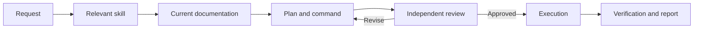

AI now handles much of my development work, Kubernetes and Azure operations, documentation, issue management, social media tasks, and even the maintenance of this blog. I have not delegated the decisions, however. I standardize the work, document its boundaries, and let AI execute it.

I did not reach this point by discovering one clever prompt. The path included local-model experiments, oversized skill files, exhausted token allowances, and automation that could fail in dangerous ways. The central lesson was simple: running a model and operating a reliable AI system are very different problems.

## Why local models remain attractive

Running a SaaS-backed agent on my own computer initially made me uncomfortable, and the concern has not disappeared. Data privacy, confidential company information, and knowing what is sent to which provider are serious questions with no universal answer.

An entirely local, offline model is therefore appealing. Yet much of the value delivered by a cloud AI product does not come from model weights alone. Search, web clients, document parsers, indexes, code execution, tool integrations, identity, and permission controls all affect the quality of the result.

Starting a local model often gives you an advanced chatbot. To reproduce a capable operator, you must also provide tools, APIs, retrieval, access policies, observability, and an execution environment. Taken far enough, this becomes a private AI platform that you must build and operate yourself.

That can be a valid choice. It resembles running your own mail server at home: possible, sometimes necessary, but accompanied by maintenance, security, hardware, and time costs. Unless you are a large organization, generate heavy usage, or earn revenue from the infrastructure, a managed service can remain cheaper. That was the outcome of my own experiments.

## A model is not an operator by itself

An LLM produces likely output from the context it receives. It can say “I don't know,” but that does not mean it will reliably identify every missing fact. In operational work, the tendency to fill an unspecified gap with a plausible assumption is a risk.

Consider a well-documented user-management API. If its endpoints, authentication, request bodies, and error responses are explicit, the documentation becomes part of the agent's operating context. The agent can construct a user-creation request and, when it has network access and credentials, execute it.

Location matters. A cloud agent cannot automatically reach a service on a private local network. An agent running on the relevant machine or network may reach it when properly authorized. What the model knows is only one part of the system; where the agent runs and what it may access are equally important.

## From API documentation to a skill

API documentation explains the technical call. A skill defines the policy for using it:

- Which documentation must be read first?
- Which environment is the default?
- Which actions must remain read-only?
- Which changes require human approval?
- How will the outcome be verified and reported?
- Should an error trigger a retry or stop the workflow?

A skill for a user-management application can instruct the agent to fetch the current API documentation, prepare the request, assess its impact, and report the result. A general-purpose model then becomes a limited operator for a specific application.

The skill should not memorize every command. It should define how to find the authoritative source, which boundaries apply, and when the agent must stop.

## A second and third pair of eyes

Agents make mistakes in API calls just as they do in code. A development error may cost time; an incorrect production call can cause data loss or an outage.

I therefore put independent checks into the workflow. One agent interprets the request and prepares the action. A second agent, with separate context, reviews both the requirement and the proposed command. If it rejects the plan, nothing runs; its findings return to the first workflow for revision.

A second pass by the same model is helpful but not fully independent. For higher-risk work, review can be sent to another model or provider. What people describe as “build with Codex, review with Claude, verify with Gemini” becomes more useful when expressed as a repeatable policy rather than a personal habit.

This is still not a proof of correctness. Two models can share the same false assumption. Human approval, least privilege, backups, dry runs, and before-and-after verification remain necessary for irreversible operations.

## Simulating the viewpoints of a team

Engineering titles such as junior, senior, lead, architect, and tester exist because a team needs different questions and responsibilities. I use a similar separation in agent workflows. The value does not come from pretending that each role is a real person; it comes from reviewing the same change through distinct, constrained contexts.

An architect may define boundaries, a developer implement the change, a reviewer examine risk and consistency, and a tester validate acceptance criteria. When this exists only in chat, the history quickly becomes fragile. When the workflow operates through an issue-management system, each role advances the issue, records evidence, and hands it to the next stage. The virtual team then works on a persistent record rather than an ephemeral conversation.

## What a local AI platform actually contains

Open-source and self-hosted components are available for this kind of system, but the following layers show the distance between downloading a model and running an operational platform:

| Layer | Example | Purpose |
| --- | --- | --- |
| Local model runtime | [Ollama](https://github.com/ollama/ollama/blob/main/docs/api.md) | Manage local models and expose them through REST and tool calling |
| High-throughput serving | [vLLM](https://docs.vllm.ai/en/latest/serving/online_serving/openai_compatible_server/) | Serve GPU-backed models through an OpenAI-compatible HTTP API |
| Model gateway | [LiteLLM](https://docs.litellm.ai/) | Put multiple providers behind one interface with authorization, limits, and cost tracking |
| Operator interface | [Open WebUI](https://docs.openwebui.com/) | Combine local and cloud models with tools, knowledge, and a user interface |
| Search | [SearXNG](https://docs.searxng.org/) | Provide a self-hosted metasearch layer over multiple sources |
| Agent orchestration | [LangGraph](https://langchain-ai.github.io/langgraph/index.html) | Build long-running, stateful workflows with human approval points |
| Tool connectivity | [Model Context Protocol](https://modelcontextprotocol.io/docs/learn/architecture) | Expose tools, resources, and prompts to agents through a client-server protocol |
| Code search and access | [CK](https://beaconbay.github.io/ck/) | Search code locally with hybrid and semantic retrieval, then expose results to agents through MCP |

This is not a deployment recipe. Identity, secret storage, sandboxing, logs, evaluations, backups, and network policy still have to be designed. A GPU cluster makes experimentation possible, but renting compute and operating a reliable, isolated model service are different businesses.

Installing the tools is the most visible and often the easiest part. The real work is analyzing an organization's processes, identifying decision and authority boundaries, delivering the right context at the right time, designing safety gates, and integrating the pieces with existing platforms. The same tool list can produce very different operating models in two organizations.

## How I applied the approach

I gradually moved the Kubernetes clusters, Azure services, development work, technical documentation, social media processes, and blog operations that I manage into this model, provided they are authorized for AI use. Today I can send an instruction from my phone and have it executed through an authorized working environment even when I am away from my desk. It sounds a little like Jarvis from Iron Man, but the mechanism is not magic. It is standards, access, and documentation.

I follow roughly the same sequence for each kind of work:

1. Turn the task into a repeatable standard.
2. Document decision points and prohibited actions.
3. Prepare the authoritative documentation.
4. Make the skill retrieve only the relevant material.
5. Add review and approval gates according to risk.
6. Verify the outcome independently after execution.

Writing the documentation can take as long as writing code. The difference is that I now prepare the definition once for many recurring tasks. The agent can use that source for later development or operational work without requiring the process to be explained again.

Ambiguity must be treated as a design flaw. I do not want a personal photograph inserted into an article without permission, a private message sent to the wrong person, or a month-old backup restored over production. These constraints cannot be captured by saying “be careful.” They require target verification, explicit prohibitions, approval conditions, and a rollback plan.

## The token wall

My first system worked, but it was not economical. The weekly allowance of the plan I used, which cost roughly €100, stopped being enough. Email, cluster and Azure operations, coding, issue tracking, and repeated review loops all consumed the same token budget. For a while, I had to buy additional capacity.

Optimization became the point where my own engineering contribution mattered most. Instead of sending all available context to every task, I designed a way to select only what was relevant.

One of my earliest skill files exceeded 100,000 words. In my current use case, I manage a similar scope with roughly 5,000 words of core instruction plus documentation loaded on demand. This is a personal example of what better context selection achieved, not a general promise of the same reduction for every workload. I did more than edit for brevity; I changed the context architecture.

- Common rules live in one place.
- Task-specific documents load only when needed.
- Agents receive the relevant issue and files, not the entire history.
- Output format and length are constrained.
- Tools return structured results instead of repeated prose.
- Simple tasks do not use the most expensive model or multiple reviews.

The same plan can now handle authorized reviews, development, issue management, cluster and platform operations, and much of my personal work. Lower token use is only one benefit. With less irrelevant context, results also became more consistent.

There is no universal optimization recipe here. The type of work, available tools, data sensitivity, cost of failure, and expected output must be analyzed together before the right combination of models, context, and controls can be selected. An efficient system comes less from copying a ready-made skill than from understanding how an organization actually works and designing for that environment.

## Employer policy, data, and authority

Technical capability is not authorization. When work involves an employer, customer, or regulated data, company policy, contracts, data classification, regulation, and provider terms all matter.

Sending information from defense, healthcare, finance, or another controlled environment to a general SaaS service may be unacceptable. An internal model, private cloud, data masking, or a restricted set of approved tools may be required instead. The appropriate design depends on the industry, the data, and the threat model.

AI should therefore not be introduced secretly into a workplace process. Security, legal, management, and engineering stakeholders need an explicit operating model. An agent should never receive broader permissions than the human role it represents.

## What I gained

The most valuable result is not that I can produce more work. It is that I recovered time. I can socialize more, go to the sea with my son almost every day, watch a film in the evening, and make our time together more meaningful.

In the past, part of my attention could remain trapped in a technical problem while I was with other people. Now I can record the problem and delegate research, alternatives, and the first implementation steps. I return when a real decision is required.

That does not reduce my responsibility. I delegated the operations, not the ownership.

## Dependency and skill decay

AI-driven work creates dependency. A service outage can stop the process. More importantly, stepping away from the craft for too long can weaken your understanding and troubleshooting ability.

Junior engineers may never build the fundamentals; senior engineers may forget details they no longer practice. When operating an agent replaces understanding the system, engineering can gradually become little more than being a customer. I explored this risk further in [Artificial Intelligence and the Human Mind: The Erosion of Thinking, Decay of Code, and Loss of Control]().

I therefore still do some work manually, read generated commands, explain architectural decisions, and make sure I can intervene without AI when the system fails. Automation should not purchase speed by giving up competence.

## Decisions stay with me

AI is no longer just a chatbot in my workflow, but it is not an unrestricted virtual employee either. It is an operational layer grounded in documentation, constrained by skills, and reviewed by other agents or models when the risk justifies it.

Successful delegation did not mean allowing AI to make more decisions. It meant implementing my decisions with less repetition, better records, and lower operational effort. Building this kind of system begins before model selection: the processes must be analyzed and organization-specific authority and control mechanisms must be designed. The technology components may be available, but turning them into a dependable operating model is the real design work.

The final review remains mine, because even when AI acts on my behalf, the model will not be the one accountable for the outcome.
