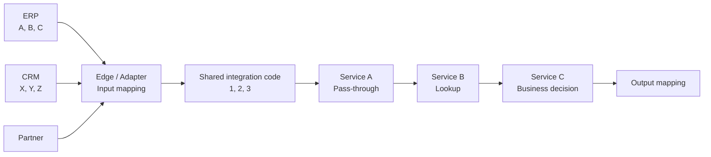
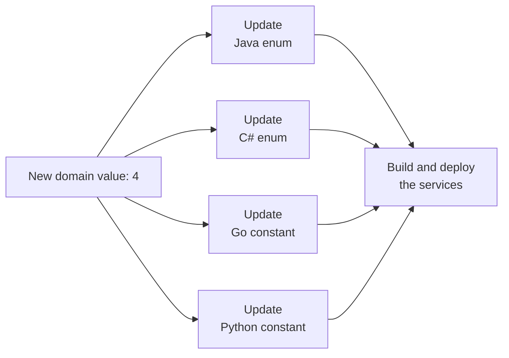

> Hizmetleri ayırmak kolaydır. İşin zor kısmı farklı hizmetlerin aynı iş konseptini doğru anladığından emin olmaktır.

Mikro hizmetler, FaaS, sunucusuz ve olay odaklı mimariler, küçük ve bağımsız bileşenler oluşturmamıza yardımcı olur. Her bileşen bir göreve odaklanabilir. Bir hizmet, sınırlı bir bağlamın sınırları ve entegrasyon sözleşmeleri dahilinde çalışabilir. Farklı bir programlama dili kullanabilir ve Kafka, HTTP, kuyruk veya veritabanı aracılığıyla veri alabilir.

Bu özgürlük faydalıdır. Ancak sistem büyüdükçe daha az görünür bir bağımlılık ortaya çıkar: **paylaşılan iş dili**.

Örneğin, bir sistem sipariş durumunu `A` olarak, diğeri `X` olarak ve bir entegrasyon sözleşmesini `1` olarak temsil edebilir. Sistemler entegrasyon sınırındaki anlam üzerinde anlaşmaya varmalıdır. Bu, her hizmetin aynı etki alanı modelini kullanması gerektiği anlamına gelmez. Sorun aynı zamanda `enum` ve `string` arasında seçim yapmaktan da daha büyük. Sahiplik, değişiklik yönetimi, uyumluluk ve hata tespitini içerir.

Bu makale tek bir çözümün her zaman doğru olduğunu iddia etmez. Bunun yerine sorunu daha küçük parçalara ayırır ve her seçeneğin maliyetini açıklar.

## Örnek Ortam

Aşağıdaki özelliklere sahip bir sistem düşünün:

- Hizmetler, girdi alan ve çıktı üreten küçük kara kutu bileşenleri olarak çalışır.
- Her bileşen bir göreve odaklanır.
- Sınırlı bir içerik bir veya daha fazla hizmet veya işlev içerebilir.
- Hizmetler farklı programlama dillerini kullanabilir.
- İletişim Kafka, HTTP, kuyruklar veya veritabanları aracılığıyla gerçekleşebilir.
- Dağıtılmış bir monolit oluşmasını önlemek için hizmetler arasındaki bağımlılıklar düşük kalmalıdır.

Basitleştirilmiş akış şuna benzer:



İlk harici sistem `A`, `B` ve `C`'i kullanır. İkinci sistem aynı anlamlar için `X`, `Y` ve `Z`'i kullanır. Entegrasyon sözleşmemiz `1`, `2` ve `3`'i kullanır:

| Ticari anlamı | ERP kodu | CRM kodu | Paylaşılan entegrasyon kodu |
| --- | --- | --- | --- |
| İlk durum | `A` | `X` | `1` |
| İkinci durum | `B` | `Y` | `2` |
| Üçüncü durum | `C` | `Z` | `3` |

Kenar eşlemesi, uygulama kodu yerine konfigürasyon olarak saklanabilir:

```json
{
  "order-status": {
    "erp": { "A": "1", "B": "2", "C": "3" },
    "crm": { "X": "1", "Y": "2", "Z": "3" }
  }
}
```

Kenar katmanı, harici değeri paylaşılan bir entegrasyon koduna dönüştürür. Bazı dahili servisler bu kodu yalnızca bir sonraki servise iletir. Bazıları bunu veritabanı anahtarı olarak kullanır. Diğerleri iş kararlarını bundan alır veya onu başka bir kelime dağarcığıyla eşleştirir.

Yeni bir değer geldiğinde, yalnızca iş davranışı değişmiyorsa bir eşleme eklemek istiyoruz. Anlamını yorumlamayan birçok hizmeti güncellemek ve dağıtmak istemiyoruz.

Artık üç hedef birbiriyle yarışıyor:

1. Uygulama kodunu değiştirmeden yeni değerler ekleyin.
2. Yazım hatalarını ve geçersiz değer hatalarını mümkün olduğunca erken tespit edin.
3. Her hizmet için paylaşılan çalışma zamanı bağımlılığından kaçının.

Tek bir yöntem bize bu üç faydayı da bedelsiz olarak sağlayamaz.

## Üç Yaklaşım ve Üç Farklı Hata Noktası

Temel sorunu üç ana seçenekle tanımlayabiliriz.

### 1. Sıralama: Erken Hatalar Ama Gizli Dağıtım Bağlantısı

Etki alanı değerlerini numaralandırmalar veya sabitler olarak tanımlamak, geliştiricilere güçlü araçlar sağlar. Bir IDE, derleyici veya test, uygulama çalıştırılmadan önce yanlış bir değeri algılayabilir.

```java
public enum OrderStatus {
    APPROVED("1"),
    WAITING("2"),
    REJECTED("3");

    private final String code;

    OrderStatus(String code) {
        this.code = code;
    }
}
```

Ancak bu güvenlik hizmet sınırlarında bedava değildir. Yeni bir değer eklendiğinde ekiplerin birçok depoyu güncellemesi gerekebilir. Bu, yalnızca değeri ileten veya onu arama anahtarı olarak kullanan hizmetleri içerebilir. Numaralandırmalar farklı dillerde değiştirilmeli, paketler yayınlanmalı ve hizmetler yeniden dağıtılmalıdır.Hizmetler birbirini doğrudan içe aktaramayabilir ancak yine de etki alanı değer kümesinin aynı sürümüne bağımlıdırlar. Bu bağımlılık bir API çağrısı olarak görünmez. Bir dizi değişiklik ve yayılma yoluyla görünür hale gelir. Bir numaralandırma, kapalı bir iş kuralını koruyabilir, ancak aynı zamanda açık bir referans veri kümesi için gizli bağlantı da oluşturabilir.



### 2. Kayıt Defteri veya Veritabanı: Merkezi Tanım ama Çalışma Zamanı Doğrulaması

İkinci seçenek, değerleri Redis'te, bir veritabanında veya paylaşılan bir kayıt defterinde depolamaktır. Daha sonra uygulama kodunu değiştirmeden yeni bir etki alanı değeri eklenebilir.

Ancak bir değerin kayıt defterinde saklanması, geliştiricinin uygulama kodunda doğru değeri kullanacağını garanti etmez. Kayıt defterinin çalışma zamanı doğrulama noktası olduğu bir tasarımda, doğrulamadan sorumlu her tüketicinin benzer sorgu ve hata işleme mantığını eklemesi gerekir:

```typescript
async function handle(message: OrderMessage): Promise<void> {
  const exists = await domainRegistry.exists(
    "order-status",
    message.status
  );

  if (!exists) {
    throw new UnknownDomainCode("order-status", message.status);
  }

  await processOrder(message);
}
```

Bu doğrulama derleme zamanında değil, çalışma zamanında gerçekleşir. Bir hizmet denetimi gerçekleştirmezse, kayıt defteri mevcut olsa bile doğrulamanın dışında kalır. Yani merkezi bir kayıt sistemi tek başına sistem çapında güvenlik sağlamaz. Gerekli her doğrulama noktasının bunu kullanması gerekir.

Bu seçim aynı zamanda hizmetlere sorgulama, önbellek, zaman aşımı, yeniden deneme ve hata işleme sorumluluklarını da ekleyebilir. Merkezi bir kayıt defteri, dağıtım bağlantısını azaltır ancak çalışma zamanı bağımlılığı ve ekstra operasyonel çalışma yaratır.

### 3. Açık Dize: Ekstra Bağımlılık Yok, Daha Sonra Hatalar Var

Üçüncü seçenek, alan kodunu açık bir dize olarak iletmektir. Değerini anlamayan bir servis, onu değiştirmeden geçebilir. Bir arama hizmeti bunu doğrudan anahtar olarak kullanabilir. Değeri yorumlayan bir hizmet yalnızca desteklediği değerleri doğrulayabilir.

Doğrudan geçiş hizmeti değeri değiştirmeden tutar:

```typescript
async function forward(message: OrderMessage): Promise<void> {
  await nextTopic.publish({
    ...message,
    status: message.status
  });
}
```

Bir arama hizmeti, önce ayrı bir kayıt defterini çağırmadan kendi iş aramasını çalıştırabilir:

```typescript
async function findPrice(domainCode: string): Promise<Price> {
  const price = await priceRepository.findByDomainCode(domainCode);

  if (!price) {
    throw new PriceNotConfigured(domainCode);
  }

  return price;
}
```

Bu yaklaşım yazım hatalarına izin verir. Öte yandan, yeni bir değer yalnızca bir eşleme veya veritabanı satırına ihtiyaç duyuyorsa ilgisiz hizmetlerin bir numaralandırma güncellemesine veya yeni bir dağıtıma ihtiyacı yoktur. Ayrıca her hizmete ayrı kayıt doğrulama mantığı eklenmesini de önler.

Yanlış bir kod ihtiyaç duyulan noktaya ulaştığında arama sonuç vermez veya iş doğrulaması başarısız olur. Hata kaybolmaz; oluşturma zamanından çalışma zamanına geçer. Kod incelemesi, testler, güvenli üretici işlevleri ve basit giriş formatı kontrolleri yazım hatalarını azaltabilir.

Bunun kabul edilebilir olup olmadığı başarısızlığın etkisine bağlıdır. Eksik bir eşleşmenin açık ve izlenebilir bir hata yaratması durumunda pratik bir seçim olabilir. Hatanın sessizce bir varsayılanı seçmesi, yetkilendirmeyi değiştirmesi veya mali kayıp yaratması yeterli değildir.

Temel farklar şunlardır:

| Yaklaşım | Hata genellikle ne zaman ortaya çıkıyor? | Ana maliyet |
| --- | --- | --- |
| Enum veya sabit | Derleme, test etme veya ayrıştırma sırasında | Birçok hizmette ve dağıtım bağlantısında değişiklikler |
| Kayıt defteri veya veritabanı doğrulaması | Çalışma zamanı doğrulaması sırasında | Sorgular, önbelleğe alma ve operasyonel bağımlılık |
| Dizeyi aç | Bir hizmetin gerçekten | değerine ihtiyacı olduğunda Yazım riski ve sonradan başarısızlık |

Asıl soru “Hangi yaklaşımda hata yoktur?” değildir. Şöyle: **Hatayı ne zaman kabul edebiliriz ve bağımlılığı nerede kabul edebiliriz?**

## Dize, Serbest Metin ve Etki Alanı Kodu Farklı Kavramlardır

`string` veri türüne sahip bir alan her zaman kontrolsüz serbest metin değildir. Üç farklı kullanımı ayırmalıyız:

| Temsil | Tanımı | Örnek |
| --- | --- | --- |
| Kontrolsüz serbest metin | Önceden tanımlanmış bir kelime dağarcığı veya formatı yoktur | Bir kullanıcı yorumu |
| Alan kodunu aç | Tanımlanmış bir formatı ve sahibi vardır ancak yeni değerleri kabul edebilir | Taşıyıcı veya ürün kategorisi kodu |
| Kapalı değer seti | Sözleşme desteklenen değerleri sınırlar | İş akışının durumları |

Bu makaledeki paylaşılan `1`, `2` ve `3` değerleri, kontrolsüz serbest metin değildir. Dizeler olarak depolanırlar ancak tanımlanmış bir etki alanına, ad alanına, biçime ve sahiplik modeline aittirler. Sözleşme ayrıca bir değer bilinmediğinde ne olması gerektiğini de tanımlar.Bu fark olmadan ekipler "dizeler esnek" olduğundan kritik durumları kontrolsüz bırakabilir. Ayrıca "numaralandırmalar güvenlidir" nedeniyle açık referans verileri için numaralandırmaları kullanarak gereksiz dağıtım bağımlılıkları da oluşturabilirler.

## Açık ve Kapalı Değer Kümeleri

Her etki alanı değeri aynı role sahip değildir.

**kapalı bir kümede**, yeni bir değer yeni davranış anlamına gelir. Örneğin bir uygulama, ödeme sonucuna göre geri ödeme, bildirim veya muhasebe işlemi başlatabilir. Bu durumda yeni bir değer yalnızca konfigürasyon değildir. İlgili hizmetin yeni davranışı anlaması gerekir.

**Açık küme** genellikle tanımlayıcı referans verileri içerir. Operatör kodları, ürün kategorileri ve entegrasyon kaynak kodları zamanla büyüyebilir. Birçok hizmet bu değerleri aktarabilir veya özel bir davranış uygulamadan bunları arama anahtarı olarak kullanabilir.

Bir değer kümesinin tüm sistem için açık veya kapalı olması gerekmez. Aynı kod, yalnızca onu ileten bir hizmet için açık olabilir, ancak ondan iş kararı alan bir hizmet için kapalı olabilir.

## DDD Bu Sorun Hakkında Bize Ne Anlatıyor?

Etki Alanına Dayalı Tasarım, büyük bir sistem için tek bir evrensel model yaratmaya çalışmaz. Her sınırlı bağlamda tutarlı bir model önerir. Aynı kavram farklı bağlamlarda farklı isimlere, yapılara ve davranışlara sahip olabilir.

Bu nedenle `1`, `2` ve `3`, tüm şirket için "tek gerçek alan modeli" olarak değerlendirilmemelidir. Bu opak değerler aynı zamanda tek başına bir entegrasyon dili değildir. Alan adı, iş anlamı, eşleme kuralları ve sözleşmeyle birlikte yayınlanmış bir entegrasyon dilinde aktarım kodları olarak çalışabilirler.

Eric Evans'ın **Yayınlanan Dil** tanımında, paylaşılan dilin bağlamlar arasında gerekli alan bilgisini ifade etmesi ve iyi bir şekilde belgelenmesi gerekir. Bu dili dağıtılmış bir sistemde pratik tutmak için aşağıdaki özelliklere sahip olmasını da bekleyebiliriz:

- açık bir sahip,
- kararlı adlandırma,
- versiyonlama,
- bilinmeyen değerler için tanımlanmış davranış.

Gerekli alan bilgisini ifade etmek ve belgelemek DDD modelinin bir parçasıdır. Sahiplik, adlandırma, sürüm oluşturma ve bilinmeyen değer politikası bu makaledeki operasyonel önerilerdir. Bunlar olmadan, paylaşılan bir dize açık bir entegrasyon sözleşmesi yerine gizli bir bağımlılığa dönüşebilir.

`A` veya `X`'i paylaşılan `1` koduna dönüştürmek bir bağdaştırıcının veya **Yolsuzlukla Mücadele Katmanının** işi olabilir. Sınırlı bir bağlam, paylaşılan kodu farklı bir şekilde yorumlarsa, kodu kendi sınırındaki yerel değer nesnesine, numaralandırmaya veya varlığa dönüştürebilir. Bu dönüşüm her hizmette değil, yalnızca yerel modelin kullanıldığı bağlamda gereklidir.

DDD bize sınırlar, sahiplik ve bağlamlar arasındaki ilişkiler hakkında rehberlik sağlar. Kodları numaralandırmalar, katalog girişleri veya dizeler olarak dağıtmak için tek bir evrensel mekanizma tanımlamaz.

## Etki Alanı Kodunu Aktarma, Arama ve Yorumlama

Bir etki alanı alanını kullanmak her zaman onun iş anlamını anlamak anlamına gelmez.

Örneğin, `priceRepository.findByDomainCode` aşağıdaki sorguyu çalıştırabilir:

```sql
SELECT price
FROM domain_prices
WHERE domain_code = :domainCode;
```

Bu hizmet, `1` kodunun ne anlama geldiğini bilmeden eşleşen kaydı bulabilir. Bu, `if (status == APPROVED)` gibi bir iş kararı vermekten farklıdır.

İş kararı veren bir hizmet, desteklediği değerleri sınırlı bağlamı içinde tanımlayabilir:

```csharp
public PaymentAction ResolveAction(string status)
{
    return status switch
    {
        "1" => PaymentAction.Capture,
        "2" => PaymentAction.Wait,
        "3" => PaymentAction.Cancel,
        _ => throw new UnsupportedOrderStatus(status)
    };
}
```

Hizmetleri değerle olan ilişkilerine göre gruplandırmak daha kullanışlıdır:

| Rol | Değeri yorumluyor mu? | Yeni bir değer için kod değişikliği | Bilinmeyen bir değere ilişkin davranış |
| --- | --- | --- | --- |
| Geçiş | Hayır | Normalde gerekli değildir | Geçerli bir değeri tutar ve iletir |
| Yapısal kullanıcı | Hayır | Normalde gerekli değildir | Eksik bir arama sonucunu yönetir |
| Anlamsal kullanıcı | Evet | Yeni davranış gerekiyorsa gereklidir | Desteklenen seti doğrular |
| Çevirmen | Kaynak ve hedef sözcüklerini anlar | Bir eşleme değişikliği yeterli olabilir | Eksik eşlemeleri reddeder veya karantinaya alır |

Bu fark, alana dokunan her hizmetin bir numaralandırmayı güncellemesi gerektiği varsayımını ortadan kaldırır.

### Arama Hizmetinin Numaralandırmaya İhtiyacı Var mı?Tek amaç yazım hatalarını önlemekse, numaralandırma her zaman doğru araç değildir. Numaralandırma, geliştiricinin kodun içine `APPROVED` yerine `APROVED` yazmasını engeller. Harici bir sistemin `"aproved"` göndermesini durdurmaz. Gelen değerin hâlâ ayrıştırılması veya doğrulanması gerekiyor.

Küme açık ve yapılandırılabilirse, numaralandırma başka bir maliyet oluşturur. Bir veritabanına satır eklemek yeterli olabilir ancak değeri yorumlamayan bir hizmetin yine de derlenip konuşlandırılması gerekir.

Aşağıdaki korumalar bir arama hizmetinde daha yararlı olabilir:

- Formatı kontrol eden, boş olmayan bir `DomainCode` değer nesnesi
- Giriş sınırında normalizasyon
- Uygun olduğunda yabancı anahtar veya referans bütünlüğü kuralı
- “Kayıt bulunamadı” için net bir sonuç veya hata türü
- Kod, alan adı, kaynak ve korelasyon kimliğini içeren günlükler
- Bilinen, bilinmeyen ve geçersiz değerlere yönelik testler

Örneğin, bir değer nesnesi, değer kümesini kapatmadan genel biçimi koruyabilir:

```typescript
class DomainCode {
  private constructor(readonly value: string) {}

  static parse(raw: string): DomainCode {
    const normalized = raw.trim().toUpperCase();

    if (!/^[A-Z0-9_-]{1,32}$/.test(normalized)) {
      throw new InvalidDomainCode(raw);
    }

    return new DomainCode(normalized);
  }
}
```

Çalışma zamanında bir yazım hatası "kayıt bulunamadı" şeklinde görünebilir. Bunun kabul edilebilir olup olmadığı bağlama bağlıdır. Eksik bir kayıt normal bir iş sonucu olduğunda, numaralandırma gereksiz olabilir. Hata, mali kayba, yanlış yetkilendirmeye veya sessiz veri kaybına neden olabileceği durumlarda üretici veya girdi sınırında durdurulmalıdır.

## Diğer Olası Yöntemler

### Paylaşılan Kitaplık veya Oluşturulan Kod

Etki alanı tanımları tek bir pakette saklanabilir veya merkezi bir şema farklı diller için kod üretebilir. Bu, manuel çoğaltmayı azaltır ve serileştirme tutarlılığını artırır.

Ancak her dilin hâlâ bir paket yayınlama sürecine ihtiyacı vardır. Hizmetlerin yeni paket sürümünü alması gerekir ve yine de başka bir dağıtıma ihtiyaç duyabilir. Paylaşılan paket iş mantığını içermeye başlarsa hizmetler arasında güçlü bir bağlantı oluşur.

### Şema ve Sözleşme Yönetimi

Avro, Protobuf, JSON Schema ve OpenAPI mesaj yapılarını ve uyumluluk kurallarını görünür hale getirir. Şema Kaydı ve CI kontrolleri, yapısal değişikliklerin tüketiciler üzerindeki etkisini erken bir aşamada gösterebilir.

Ancak şema uyumluluğu iş anlamı uyumluluğuyla aynı şey değildir. Tüketici yeni değeri henüz anlamadığında bir alan mevcut olabilir ve doğru dize türüne sahip olabilir. Değer setinin şemada bir numaralandırma ile kapatılması, eski tüketicilerin yeni bir değer alması sorununu da geri getiriyor.

## Bir Hatanın Kaynağını Nasıl Bulabiliriz?

Dinamik kodlar, her hizmetin tam etki alanı geçmişi tablosunu tutmasını gerektirmez. Bir mesaj veya iz az miktarda yararlı bağlam taşıyabilir:

```json
{
  "correlationId": "flow-456",
  "domain": "order-status",
  "value": "approved",
  "mappingVersion": "2026-07-04",
  "producer": "edge-order-adapter"
}
```

Bir hizmetin değeri değişmiyorsa ayrı bir denetim kaydı oluşturmasına gerek yoktur. Değeri değiştirdiğinde eski değeri, yeni değeri, nedeni, hizmeti ve eşleme sürümünü bir denetim olayı veya izleme özelliği olarak kaydedebilir.

Bu yaklaşım hatayı engellemez ancak değerin nerede oluşturulduğunu veya değiştirildiğini bulmayı kolaylaştırır.

## Pratik Bir Hibrit Model

Aşağıdaki model örnek sistem için bir başlangıç noktası olabilir:

1. Harici değerleri uçta veya yolsuzlukla mücadele katmanında paylaşılan bir entegrasyon koduna dönüştürün.
2. Paylaşılan kodu tüm sistemin etki alanı modeli olarak değil, bağlamlar arasında bir entegrasyon dili olarak ele alın.
3. Değer kümelerini açık referans kümeleri veya kapalı davranış kümeleri olarak sınıflandırın.
4. Numaralandırmaları veya benzer yerel türleri yalnızca iş kararlarını kapalı kümelerden alan hizmetlerde kullanın.
5. Açık kümeleri paylaşılan dize kodları olarak iletin. Bir katalog yönetimi destekleyebilir ancak her hizmet için eşzamanlı bir çalışma zamanı bağımlılığı olması gerekmez.
6. Geçiş ve arama hizmetlerinin, iyi biçimlendirilmiş bilinmeyen değerleri kod değişikliği olmadan iletmesine veya sorgulamasına izin verin.
7. Her sözleşmede bilinmeyen değerler için davranışı tanımlayın: reddet, ilet, varsayılanı kullan veya karantinaya al.
8. Sürüm eşleme değişiklikleri yapın ve etkin eşleme sürümünün izlenebilir olmasını sağlayın.
9. CI/CD'de şema uyumluluğu ve tüketici sözleşmesi testlerini çalıştırın.Bu modelin de bir maliyeti var. Sözleşme yönetimine, olası katalog veya önbellek dağıtımına ve gözlemlenebilirliğe ihtiyaç duyar. Ancak her hizmete aynı karmaşıklığı eklemek yerine karmaşıklığın çoğunu, alan değerinin gerçekte yorumlandığı sınırlarda tutar.

## Neden Mükemmel Bir Cevap Yok?

DDD, model sınırlarını, sahipliğini ve bağlamlar arasındaki ilişkileri açıklar. Şema araçları yapısal uyumluluğu kontrol eder. Kayıt defterleri ve kataloglar dinamik yönetimi destekler. Numaralandırmalar, hizmetlerin bilinen değerleri güvenli bir şekilde kullanmasına yardımcı olur. Açık dize kodları, değişiklik ve dağıtım bağlantısını azaltır.

Bu seçeneklerin hiçbiri bize aşağıdakilerin tümünü ücretsiz olarak sunmaz:

- derleme zamanı güvenliği,
- kod değişikliği gerektirmeyen uzantı,
- merkezi tutarlılık,
- çalışma zamanı bağımsızlığı.

Bu, sorunun çözülemeyeceği anlamına gelmez. Farklı yöntemler farklı durumlarda işe yarar. Ancak incelediğim kaynaklarda ve gerçek sistemlerde çok dilli, dağıtık bir hizmet zincirinde alan kodu yönetiminden her türlü maliyeti ortadan kaldıran bir yaklaşıma rastlamadım. Numaralandırmalar, kayıtlar ve açık dizelerin her biri bir tür güvenlik sağlarken başka bir yerde maliyet yaratır.

Yöntem seçmeden önce şu sorulara cevap vermeliyiz:

- Değerin sahibi hangi sınırlı bağlamdır?
- Yeni bir değer sistem davranışını değiştirir mi?
- Hizmet değeri yorumluyor mu, arama anahtarı olarak mı kullanıyor yoksa yalnızca iletiyor mu?
- Bilinmeyen bir değer için güvenli davranış nedir?
- Harita değişikliği eski olayların anlamını değiştirebilir mi?
- Kaynak değerini ve eşleme versiyonunu takip edebilir miyiz?
- Merkezi kataloğun bulunmadığı durumlarda akış devam edebilir mi?

Bu soruları yanıtlamadan önce bir numaralandırma, veritabanı veya Şema Kaydı seçmek çoğu zaman sorunu çözmek yerine başka bir katmana taşır.

## Sonuç

Dağıtılmış etki alanı yönetiminde temel sorun, değerlerin nerede saklandığı değildir. Asıl sorun **iş anlamının sahibi ile onu aktaran, araştıran, tercüme eden veya yorumlayan hizmetler arasındaki sözleşmenin nasıl geliştiğidir**.

Bir alan kodunu iletmek, onu arama anahtarı olarak kullanmak ve ticari anlamını yorumlamak farklı eylemlerdir. Gerekli güvenlik, hizmetin değerle ilişkisine bağlı olmalıdır.

Bir numaralandırma birçok hatayı erkenden bulur, ancak değer kümesini paylaşan hizmetler arasında değişiklik ve dağıtım bağlantısı oluşturabilir. Kayıt defteri merkezi doğrulama sağlar, ancak kontrolü çalışma zamanına taşır ve altyapı çalışması ekler. Açık bir dize, yazım riskini kabul eder, ancak ilgisiz hizmetlerde değişiklikleri önler ve bir hizmetin gerçekten değere ihtiyacı olduğunda hatayı gösterir.

Bu nedenle sözleşmeye dayalı bir dize kodu, akışın eksik bir eşleşmeden sonra güvenli bir şekilde durdurulabileceği düşük riskli, açık değer kümeleri için pratik bir seçenek olabilir. Kod incelemesi ve testleri yazım riskini azaltır. Hataları, günlükleri ve izlemeyi temizleme, çalışma zamanı sorunlarını görünür hale getirir. Kritik iş kararları için ilgili sınırlı bağlam, yalnızca dolaylı çalışma zamanı hatasına bağlı olmak yerine desteklediği değerleri doğrulamalıdır.

Dolayısıyla doğru soru şu değil:

> “Alan değeri bir numaralandırma mı yoksa bir dize mi olmalı?”

Bu:

> **“Bu değerin sahibi kim, onu gerçekte hangi hizmetler yorumluyor ve değer bilinmediğinde sözleşme ne diyor?”**

Dağıtılmış bir sistemde bağımsızlık, hizmetlerin hiçbir bilgiyi paylaşmadığı anlamına gelmez. Paylaşılan bilgilerin sınırlarının, sahibinin, versiyonunun ve değişim sürecinin net olduğu anlamına gelir.

En azından benim incelediğim kaynaklarda ve sistemlerde bu dengeyi tamamen ve maliyetsiz çözen bir yöntem hala yok. Her yöntem bir tür güvenlik sağlar ve bir ödünleşim getirir. Bu nedenle her sistemin, alan kodlarının nerede açık veya kapalı olacağına ve geçersiz bir değerin hangi sınırda durması gerektiğine karar vermesi gerekir.

## Daha Fazla Okuma- [Martin Fowler — Sınırlı Bağlam](https://martinfowler.com/bliki/BoundedContext.html)
- [Eric Evans — Etki Alanı Odaklı Tasarım Referansı](https://www.domainlanguage.com/wp-content/uploads/2016/05/DDD_Reference_2015-03.pdf)
- [Microsoft — Mikro hizmet etki alanı modeli tasarlama](https://learn.microsoft.com/dotnet/architecture/microservices/microservice-ddd-cqrs-patterns/microservice-domain-model)
- [Microsoft — Her mikro hizmet için etki alanı modeli sınırlarını belirleme](https://learn.microsoft.com/dotnet/architecture/microservices/architect-microservice-container-applications/identify-microservice-domain-model-boundaries)
- [Laigner ve ark. — Mikro Hizmetlerde Veri Yönetimi: Uygulamanın Durumu, Zorluklar ve Araştırma Yönergeleri](https://arxiv.org/abs/2103.00170)
- Eric Evans — *Etki Alanı Odaklı Tasarım: Yazılımın Kalbinde Karmaşıklıkla Mücadele Etmek*
- Vaughn Vernon — *Alan Odaklı Tasarımın Uygulanması*
