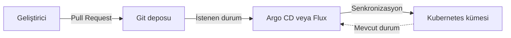
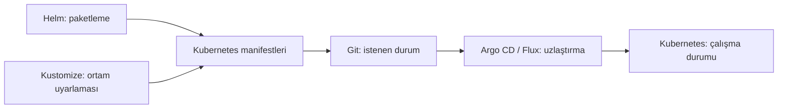

Kubernetes öğrenmeye başlayanların karşısına kısa süre içinde yeni kavramlar çıkar: YAML manifestleri, Helm Chart, Kustomize, GitOps, Argo CD ve Flux. Bu kavramların her biri farklı bir problemi çözer. Ancak çoğu kaynak onları tek tek anlattığı için araçların birbirleriyle ilişkisini görmek zorlaşabilir.

Bu yazının amacı bütün komutları ezberletmek değil, büyük resmi kurmaktır: Kubernetes neyi çalıştırır, Helm neyi paketler, Kustomize neyi özelleştirir ve GitOps bu süreci nasıl yönetir?

## Önce temel problem: Kubernetes ne yapar?

Kubernetes, container olarak paketlenmiş uygulamaları çalıştıran ve yöneten bir orkestrasyon platformudur. Bir uygulamanın kaç kopya çalışacağını, hangi porttan erişileceğini, hangi konfigürasyonu kullanacağını ve hata durumunda nasıl yeniden başlatılacağını tanımlayabiliriz.

Bu istekleri Kubernetes'e genellikle YAML manifestleriyle bildiririz.

```yaml
apiVersion: apps/v1
kind: Deployment
metadata:
  name: orders-api
spec:
  replicas: 2
  selector:
    matchLabels:
      app: orders-api
  template:
    metadata:
      labels:
        app: orders-api
    spec:
      containers:
        - name: orders-api
          image: registry.example.com/orders-api:1.4.0
          ports:
            - containerPort: 8080
```

Bu dosya Kubernetes'e kabaca şunu söyler: `orders-api:1.4.0` imajından iki pod çalıştır ve container'ın 8080 portunu kullan.

Kubernetes burada uygulamayı çalıştırır ve tanımlanan durumu korumaya çalışır. Fakat manifestleri farklı ortamlar için nasıl yöneteceğimiz, tekrarları nasıl azaltacağımız veya değişiklikleri kümeye kimin uygulayacağı Kubernetes'in tek başına çözdüğü sorunlar değildir.

## Manifest sayısı arttığında ne olur?

Gerçek bir uygulama çoğunlukla yalnızca bir `Deployment` dosyasından oluşmaz. Zamanla aşağıdaki kaynaklar eklenir:

- Service
- ConfigMap
- Secret referansları
- Ingress veya Gateway
- HorizontalPodAutoscaler
- ServiceAccount ve RBAC kuralları
- NetworkPolicy
- ortam bazlı kaynak limitleri ve replica sayıları

Bir de geliştirme, test ve production ortamları varsa aynı dosyaların küçük farklarla kopyalandığı bir yapı oluşabilir. Örneğin geliştirme ortamında tek replica yeterliyken production ortamında dört replica gerekebilir. Kullanılan domain, image tag'i ve kaynak limitleri de değişebilir.

Helm ve Kustomize bu yönetim probleminin farklı taraflarına yaklaşır.

## Helm nedir?

Helm, Kubernetes için paket yöneticisi olarak tanımlanır. Bir uygulamaya ait Kubernetes kaynaklarını yeniden kullanılabilir ve versiyonlanabilir bir paket hâline getirir. Bu pakete **Chart** denir.

Bir Helm Chart genel olarak şu yapıya sahiptir:

```text
orders-api/
├── Chart.yaml
├── values.yaml
└── templates/
    ├── deployment.yaml
    ├── service.yaml
    └── ingress.yaml
```

- `Chart.yaml`, paketin adı ve versiyonu gibi bilgileri tutar.
- `values.yaml`, değiştirilebilir varsayılan değerleri içerir.
- `templates/`, bu değerleri kullanan Kubernetes manifest şablonlarını barındırır.

Örneğin replica sayısı `values.yaml` içinde tanımlanabilir:

```yaml
replicaCount: 2

image:
  repository: registry.example.com/orders-api
  tag: "1.4.0"
```

Deployment şablonu ise bu değerleri kullanır:


```yaml
spec:
  replicas: {{ .Values.replicaCount }}
  template:
    spec:
      containers:
        - name: orders-api
          image: "{{ .Values.image.repository }}:{{ .Values.image.tag }}"
```


Bu sayede aynı Chart farklı değer dosyalarıyla farklı ortamlara kurulabilir.

```bash
helm upgrade --install orders-api ./orders-api \
  --values values-prod.yaml
```

Helm özellikle şu durumlarda güçlüdür:

- Aynı uygulama farklı müşterilere veya kümelere kurulacaksa
- Paket versiyonlamak ve dağıtmak gerekiyorsa
- Çok sayıda ayarın kullanıcı tarafından değiştirilebilmesi isteniyorsa
- PostgreSQL, Prometheus veya cert-manager gibi hazır çözümler kurulacaksa
- Uygulama bir OCI registry üzerinden Chart olarak paylaşılacaksa

Ancak şablon sayısı ve koşullar arttıkça Chart'ın okunması zorlaşabilir. Kubernetes YAML dosyaları zamanla bir şablon programlama diline dönüşebilir. Bu nedenle her değişkeni parametre hâline getirmek iyi bir tasarım değildir.

## Kustomize nedir?

Kustomize, mevcut Kubernetes YAML dosyalarını şablon diline dönüştürmeden özelleştirmeyi sağlar. Temel yaklaşımı, ortak kaynakları bir **base** altında tutmak ve ortama özel değişiklikleri **overlay** olarak uygulamaktır.

```text
k8s/
├── base/
│   ├── deployment.yaml
│   ├── service.yaml
│   └── kustomization.yaml
└── overlays/
    ├── dev/
    │   └── kustomization.yaml
    └── prod/
        └── kustomization.yaml
```

Base, bütün ortamların ortak tanımını içerir. Production overlay'i ise yalnızca farkı belirtir:

```yaml
apiVersion: kustomize.config.k8s.io/v1beta1
kind: Kustomization

resources:
  - ../../base

images:
  - name: registry.example.com/orders-api
    newTag: 1.4.0

replicas:
  - name: orders-api
    count: 4
```

Ortaya çıkacak manifesti görmek için:

```bash
kubectl kustomize k8s/overlays/prod
```

Uygulamak için:

```bash
kubectl apply -k k8s/overlays/prod
```

Kustomize özellikle şu durumlarda uygundur:

- Ortamlar arasında az ve belirgin farklar varsa
- Kubernetes manifestlerinin sade YAML olarak kalması isteniyorsa
- Ortak bir base üzerinden dev, test ve prod varyasyonları üretilecekse
- Yeni bir şablon dili kullanmadan patch tabanlı değişiklik yapılacaksa
- `kubectl` ile yerleşik gelen bir çözüm tercih ediliyorsa

Kustomize bir paket yöneticisi değildir. Chart bağımlılıkları, Chart repository'si veya release geçmişi gibi Helm özelliklerini sağlamaz. Onun temel işi mevcut manifestleri düzenlemek ve birleştirmektir.

## Helm mi, Kustomize mı?

Bu soru çoğu zaman iki araçtan yalnızca biri seçilmek zorundaymış gibi sorulur. Oysa araçların güçlü olduğu alanlar farklıdır.

| İhtiyaç | Helm | Kustomize |
|---|---|---|
| Uygulamayı paketlemek | Güçlü | Amaç bu değil |
| Çok sayıda parametre sunmak | Güçlü | Sınırlı kullanım için uygun |
| Ortam farklarını yönetmek | Values dosyalarıyla | Base ve overlay ile |
| Manifestlerin doğrudan okunması | Şablonlar nedeniyle zorlaşabilir | Genellikle daha kolay |
| Paket versiyonu ve bağımlılık | Var | Yok |
| Kubernetes'e yerleşik kullanım | Ayrı CLI gerekir | `kubectl` içinde bulunur |

Basit bir karar kuralı şöyle kurulabilir:

- Yeniden kullanılabilir ve dağıtılabilir bir uygulama paketi üretiyorsak Helm güçlü bir adaydır.
- Kendi uygulamamızın birkaç ortamdaki küçük farklarını yönetiyorsak Kustomize daha sade kalabilir.
- İhtiyaç varsa Helm ile üretilen kaynakların üzerine Kustomize değişiklikleri de uygulanabilir.

Önemli olan aracı alışkanlıkla değil, değişkenliğin türüne göre seçmektir.

## GitOps nedir?

Helm ve Kustomize manifest üretme veya özelleştirme araçlarıdır. GitOps ise sistemin nasıl yönetileceğine ilişkin bir çalışma modelidir.

GitOps yaklaşımında Git deposu, sistemin olması gereken durumunu tutar. Bir geliştirici veya operasyon ekibi doğrudan production kümesine bağlanıp komut çalıştırmak yerine Git üzerinde değişiklik yapar. Değişiklik incelenir, onaylanır ve bir GitOps controller tarafından kümeye uygulanır.

Basitleştirilmiş akış şöyledir:



Burada Git yalnızca dosyaların saklandığı yer değildir; **istenen durumun kayıt altına alındığı kaynak** hâline gelir.

## Argo CD ve Flux ne yapar?

Argo CD ve Flux, GitOps yaklaşımını Kubernetes üzerinde uygulayan yaygın araçlardır. Git deposundaki manifestleri izler, bunları kümedeki mevcut durumla karşılaştırır ve aradaki farkı görünür hâle getirir. Yapılandırmaya bağlı olarak farkları otomatik olarak da giderebilirler.

Örneğin Git'te replica sayısı dört olarak tanımlanmışken kümede elle ikiye düşürülürse controller bu sapmayı tespit eder. Otomatik senkronizasyon açıksa sistemi tekrar Git'teki duruma getirebilir.

Bu çalışma şekline **reconciliation**, yani uzlaştırma döngüsü denir.

GitOps'un sağlayabileceği başlıca avantajlar şunlardır:

- Değişikliklerin Pull Request üzerinden incelenmesi
- Kimin, neyi, ne zaman değiştirdiğinin izlenebilmesi
- Kümedeki manuel ve kayıt dışı değişikliklerin tespit edilmesi
- Önceki Git revizyonuna dönerek geri alma sürecinin sadeleşmesi
- Ortamların aynı yöntemle tekrar üretilebilmesi
- Deploy yetkisinin geliştirici makineleri veya klasik CI sistemleri yerine sınırlı bir controller'da tutulması

GitOps bütün operasyon problemlerini kendiliğinden çözmez. Hatalı manifest Git'e alındığında hata da kontrollü biçimde dağıtılabilir. Secret yönetimi, testler, onay mekanizmaları, erişim kontrolü ve geri dönüş stratejisi ayrıca tasarlanmalıdır.

## CI/CD ile GitOps arasındaki fark nedir?

Klasik bir CI/CD akışında pipeline uygulamayı derler, container imajını üretir ve çoğu zaman doğrudan kümeye deploy eder. Bunun için pipeline'ın Kubernetes erişim bilgilerine sahip olması gerekir.

GitOps modelinde sorumluluk ayrılabilir:

1. CI kodu test eder.
2. CI container imajını üretip registry'ye gönderir.
3. Dağıtım deposundaki image tag'i güncellenir.
4. Argo CD veya Flux değişikliği görür.
5. GitOps controller yeni durumu kümeye uygular.

Yani CI hâlâ vardır; fakat Kubernetes'e doğrudan deploy etmek zorunda değildir. CI bir artifact üretir, CD tarafında ise kümenin içindeki controller Git'ten değişikliği çeker. Bu nedenle GitOps çoğunlukla **pull tabanlı deployment** modeli olarak anılır.

## Bu kavramlar birlikte nasıl çalışır?

Araçları tek cümleyle konumlandırırsak:



Örnek bir projede süreç şu şekilde kurulabilir:

1. Uygulama kaynak kodu kendi Git deposunda tutulur.
2. CI testlerden sonra `orders-api:1.4.0` imajını üretir.
3. Uygulamanın kurulumu bir Helm Chart olarak paketlenir.
4. Ortama özel values dosyaları veya Kustomize overlay'leri dağıtım deposunda saklanır.
5. Production image tag'i Pull Request ile `1.4.0` olarak güncellenir.
6. Argo CD değişikliği algılar ve Kubernetes kümesiyle senkronize eder.
7. Dağıtım sağlığı Argo CD ve gözlemlenebilirlik araçları üzerinden takip edilir.

Bu yalnızca örnek bir modeldir. Küçük bir ekip için ayrı kod ve deployment depoları gereksiz olabilir. Büyük veya regüle bir yapıda ise yetki ayrımı, onay süreçleri ve denetlenebilirlik nedeniyle ayrı depolar anlamlı olabilir.

## Her projede hepsine ihtiyaç var mı?

Hayır. Araç sayısının artması her zaman olgunluk göstergesi değildir.

Küçük bir uygulama için birkaç sade YAML dosyası ve `kubectl apply` yeterli olabilir. Ortam farkları oluştuğunda Kustomize eklenebilir. Uygulama tekrar kullanılabilir bir paket hâline geldiğinde Helm tercih edilebilir. Dağıtım sayısı, ekip büyüklüğü ve denetim ihtiyacı arttığında Argo CD veya Flux ile GitOps yaklaşımına geçilebilir.

Kabaca şöyle düşünebiliriz:

| Senaryo | Muhtemel başlangıç noktası |
|---|---|
| Tek uygulama, tek ortam, az sayıda kaynak | Düz Kubernetes YAML |
| Aynı uygulama, birkaç ortam, küçük farklar | Kustomize |
| Tekrar kullanılabilir veya dışarı dağıtılan uygulama | Helm Chart |
| Çok sayıda uygulama ve ortam, denetlenebilir deployment | GitOps + Argo CD/Flux |
| Paketleme ve ortam özelleştirmesi birlikte gerekli | Helm + Kustomize + GitOps |

Buradaki tablo kesin bir reçete değildir. Ekip deneyimi, güvenlik beklentileri, uygulama sayısı ve operasyon yükü kararı değiştirebilir.

## Sık yapılan hatalar

Bu araçlar kullanılırken bazı hatalar tekrar eder:

- Ortam başına bütün YAML dosyalarını kopyalamak
- Helm içindeki her satırı parametre hâline getirmek
- Kustomize overlay'lerinde base yapısını tamamen değiştirecek kadar patch üretmek
- GitOps kullanırken kümeye elle müdahale etmeyi normal operasyon şekli olarak sürdürmek
- `latest` gibi değişken image tag'leri kullanmak
- Secret değerlerini şifrelemeden Git'e koymak
- Render edilen manifesti deployment öncesinde doğrulamamak
- Git'teki değişiklik ile çalışan container imajı arasında izlenebilir bağ kurmamak
- Otomatik senkronizasyonu geri dönüş ve sağlık kontrolü tasarlamadan açmak

Araçlardan bağımsız temel ilke şudur: üretilecek manifest anlaşılabilir, değişiklik izlenebilir ve çalışan sürüm yeniden üretilebilir olmalıdır.

## Sonuç

Kubernetes, Helm, Kustomize ve GitOps aynı problemin rakip çözümleri değildir. Bir dağıtım sürecinin farklı katmanlarında görev alırlar.

Kubernetes uygulamayı çalıştırır. Helm uygulamayı paketler. Kustomize manifestleri belirli bir ortama uyarlar. Git istenen durumu kayıt altına alır. Argo CD veya Flux ise bu durumun Kubernetes kümesinde korunmasını sağlar.

İyi bir başlangıç için bütün araçları aynı anda sisteme eklemek gerekmez. Önce mevcut problemin hangi katmanda olduğunu belirlemek gerekir: paketleme mi, ortam farklılığı mı, değişikliklerin denetlenmesi mi, yoksa kümeyle Git arasındaki tutarlılık mı?

Doğru araç, en popüler olan değil; sistemdeki gerçek karmaşıklığı azaltan araçtır.

## Daha Fazla Okuma

- [Kubernetes — Kustomize ile bildirimsel nesne yönetimi](https://kubernetes.io/docs/tasks/manage-kubernetes-objects/kustomization/)
- [Helm — Introduction to Helm](https://helm.sh/docs/intro/introduction/)
- [Argo CD — Declarative GitOps CD for Kubernetes](https://argo-cd.readthedocs.io/en/stable/)
- [Argo CD — CI pipeline otomasyonu](https://argo-cd.readthedocs.io/en/latest/user-guide/ci_automation/)
- [Helm Chart'ları Localde Render Etme ve Yönetme]()
- [Kubernetes Üzerinde Versioning ve Releasing Yönetimi]()
