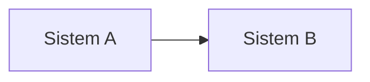
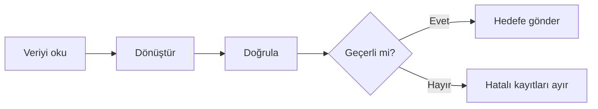
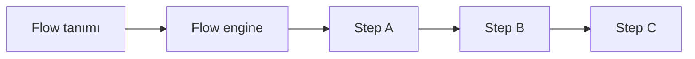
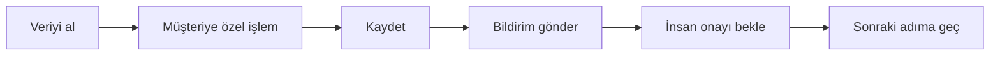
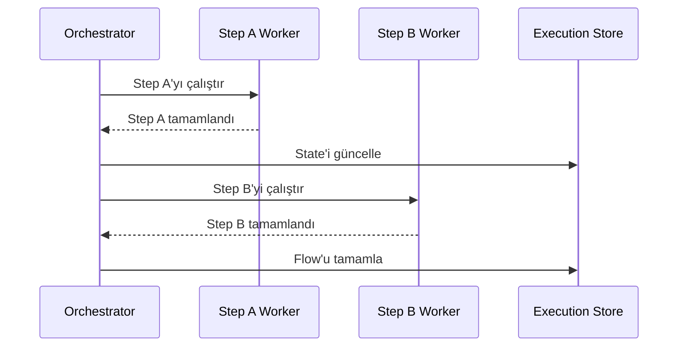
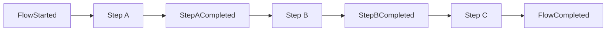
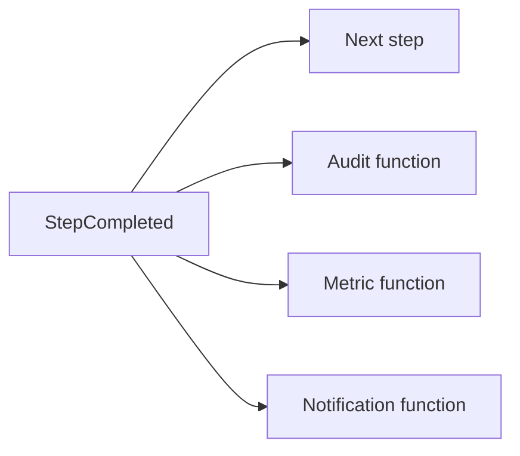
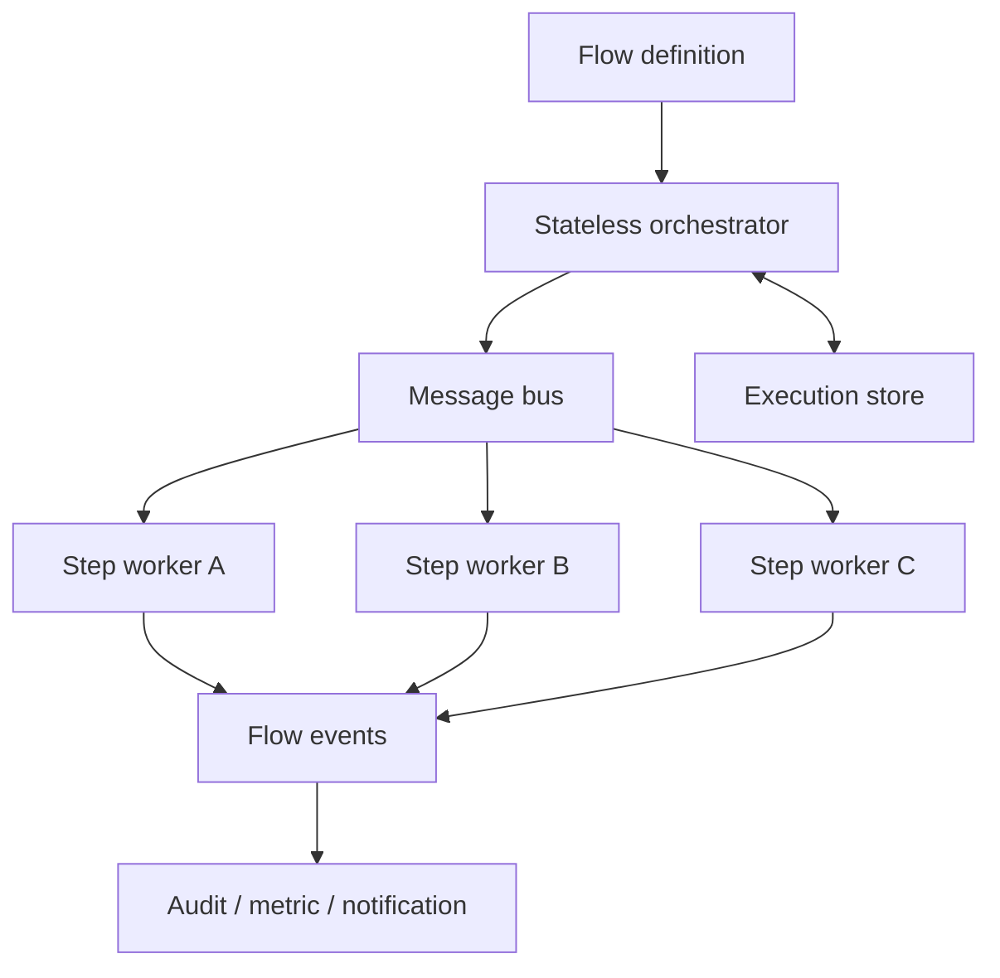

Bir noktadaki veriyi başka bir noktaya taşımakla başlayan basit bir ihtiyaç, dönüşüm, doğrulama, bildirim ve çalışma anında değişen kurallar eklendikçe bir flow engine problemine dönüşebilir. Bu yazıda bu dönüşümün nerede başladığını ve hazır bir araçtan özel bir yürütme modeline ne zaman geçilmesi gerektiğini aynı örnek üzerinden inceleyeceğim.

## Flow Nedir?

Bir proje geliştirdiğimizi ve amacımızın A sistemindeki veriyi B sistemine taşımak olduğunu düşünelim:



Bu haliyle karşımızda daha çok bir **veri entegrasyonu** veya **data pipeline** problemi vardır. Logstash, Azure Data Factory ve Apache NiFi gibi araçlar farklı kaynaklardan veri okuyup hedef sistemlere taşıyabilir. Henüz özel bir flow engine geliştirmemizi gerektiren bir durum yoktur.

Gerçek projelerde veri çoğunlukla doğrudan taşınmaz. Önce formatı dönüştürülür, zorunlu alanları doğrulanır ve hatalı kayıtlar ayrılır:



Artık yalnızca verinin nereden nereye gittiğini değil, hangi adımlardan ve hangi koşullardan geçeceğini de tarif ediyoruz. Flow, bir işin adımlarını, bu adımlar arasındaki geçişleri ve farklı sonuçlarda izlenecek yolları tanımlayan yapıdır.

## Flow'a Ne Zaman İhtiyaç Duyulur?

Her sıralı işlem ayrı bir flow altyapısı gerektirmez. Adımlar az, sabit ve yalnızca geliştiriciler tarafından değiştiriliyorsa süreç normal uygulama kodu içinde yönetilebilir:

```text
Oku → Doğrula → Dönüştür → Kaydet
```

Bu da bir flow'dur; ancak tanımı kod tabanının içindedir. Adım eklemek veya sırasını değiştirmek için kodu güncellemek, test etmek ve yeniden yayımlamak gerekir. Bu yazıda bunu **statik flow** olarak adlandıracağım.

Adımlar arttığında, koşullu yollar oluştuğunda, hata alan bir işin yeniden denenmesi veya sürecin hangi aşamada olduğunun izlenmesi gerektiğinde flow ayrı bir kavram haline gelmeye başlar. Buradaki ölçüt yalnızca adım sayısı değildir. Üç adımdan oluşan fakat iki gün insan onayı bekleyen bir süreç, yirmi metodun arka arkaya çağrıldığı kısa bir işlemden daha güçlü bir flow yönetimine ihtiyaç duyabilir.

Flow'a asıl ihtiyaç, sürecin ilerleme durumunu ve hata yollarını uygulama çağrısından bağımsız olarak yönetmek istediğimizde ortaya çıkar. Aşağıdaki belirtiler bu ihtiyacı görünür hale getirir:

- Süreç tek bir HTTP isteğinin veya uygulama prosesinin yaşam süresini aşıyorsa
- Bir dış olay, zamanlayıcı veya insan kararı bekleniyorsa
- Hata sonrasında sürecin baştan değil kaldığı adımdan devam etmesi gerekiyorsa
- Operasyon ekibinin her instance'ın hangi adımda olduğunu görmesi isteniyorsa
- Aynı sürecin farklı müşteriler veya koşullar için farklı yollar izlemesi gerekiyorsa

Bu ihtiyaçların hiçbiri tek başına özel bir engine geliştirmeyi zorunlu kılmaz. Önce flow'un kod içinde kalıp kalamayacağına, ardından hazır bir yürütme aracının süreci karşılayıp karşılamadığına bakılır.

## Flow Engine Nedir?

Flow engine, tanımlanan akışın hangi adımının ne zaman çalışacağını yöneten yürütme katmanıdır. Flow tanımını okur; başlangıç adımını, sıradaki geçişi ve tamamlanma koşulunu belirler. İhtiyaca göre retry, timeout, bekleme, paralel çalışma ve execution state gibi davranışları da yönetir.



Birden fazla flow çalıştırmak, hatadan sonra kaldığı yerden devam etmek veya uzun süre bekleyen süreçleri takip etmek istiyorsak bu sorumlulukları uygulama kodu boyunca dağıtmak yerine bir yürütme katmanında toplamak anlamlı hale gelir.

## Hazır Flow Araçları Ne Yapar?

Flow ihtiyacı ortaya çıktığında önümüzde kod tabanlı çözümler, hazır engine'ler ve özel geliştirme gibi farklı seçenekler bulunur. Farklı problem türleri için yıllardır kullanılan olgun araçlar vardır; ancak hepsi aynı tür akışı çözmez.

| Araç | Temel kullanım alanı | Çalışma yaklaşımı |
| --- | --- | --- |
| Logstash | Log ve event pipeline'ları | Input, filter ve output zinciri |
| Azure Data Factory | Veri taşıma ve ETL/ELT | Yönetilen pipeline ve activity'ler |
| Apache NiFi | Görsel veri akışı ve sistemler arası aktarım | Processor, connection ve kuyruklar |
| Apache Airflow | Zamanlanan veri ve batch işlerinin orkestrasyonu | Kodla tanımlanan DAG ve task'lar |
| AWS Step Functions | Uygulama ve servis orkestrasyonu | State machine ve yönetilen execution |

NiFi; routing, transformation, kuyruklama, back-pressure ve data provenance gibi veri akışı ihtiyaçlarını birlikte sunar. Bu yönünü [Apache NiFi ile Veri Akışı Otomasyonu]() yazısında daha ayrıntılı incelemiştim.

Airflow'da işler bir DAG içindeki task ve bağımlılıklar olarak tanımlanır. Schedule ve backfill gibi yetenekleri nedeniyle özellikle veri pipeline'larında güçlüdür. Step Functions ise state machine yaklaşımıyla AWS servislerini, Lambda fonksiyonlarını ve harici işleri belirli bir sıra ve karar yapısı içinde çalıştırır.

Bu araçlar yalnızca kutuları birbirine bağlamaz. Scheduling, retry, state takibi, execution history ve operasyon ekranı gibi geliştirmesi ve işletmesi pahalı yetenekleri de sağlar. Bu nedenle daha önce [Harici Araçlardan Doğru Şekilde Faydalanma]() yazısında ele aldığım soru burada da geçerlidir: Bu problem gerçekten bizim ürünümüze mi ait, yoksa yıllardır başka ekiplerin çözdüğü bir altyapı problemi mi?

## Hazır Araçlar Nerede Zorlanmaya Başlar?

Örneğimizi biraz daha büyütelim. Flow artık yalnızca veriyi dönüştürüp hedef sisteme göndermiyor:



Node'ların içine ürüne özgü davranışlar girmeye başladığında hazır aracın doğal çalışma modeliyle aramızdaki mesafe artar. Örneğin NiFi içinde script çalıştıran processor'lar vardır. Gerektiğinde derlenmiş özel extension'lar da geliştirilebilir. Ancak temel iş kurallarını çok sayıda script veya araca özel extension içine yerleştirmek; test, bağımlılık yönetimi, CI/CD ve versiyonlama süreçlerini normal bir uygulama kod tabanına göre zorlaştırabilir.

Airflow task'ları içinde de özel kod çalıştırabiliriz. Fakat Airflow'un ana çalışma modeli, son kullanıcıların runtime sırasında node ekleyip çıkardığı genel amaçlı bir low-code ürün olmaktan çok, geliştiriciler tarafından tanımlanan workflow'ların yürütülmesine yakındır. Hazır bir aracı kullanmak için sürekli adapter, plugin ve workaround geliştiriyorsak araç artık problemi azaltmak yerine ürün modelimizi şekillendiriyor olabilir.

Birçok flow aracının Kafka veya RabbitMQ yerine ya da bunların yanında kendi queue ve state yapılarını kullanmasının da bir nedeni vardır. Bir message broker mesajı taşır; fakat bir flow engine ayrıca hangi adımın beklendiğini, hangisinin tamamlandığını, retry sayısını, timeout'u, flow versiyonunu ve execution geçmişini bilmek zorundadır. Broker bu bilgilerin tamamını tek başına sağlamaz.

## Özel Flow Engine Ne Zaman Gündeme Gelir?

Kullanıcıların bir konfigürasyon veya görsel tasarım ekranı üzerinden node ekleyip çıkarabildiğini düşünelim:

```text
Node ekle → Bağlantıyı değiştir → Kural tanımla → Flow'u yayımla
```

Bu noktada flow, geliştiricinin önceden kodladığı sabit bir pipeline olmaktan çıkar ve ürünün çalışma anında yorumladığı bir veriye dönüşür. Aşağıdaki ihtiyaçların birkaçının birlikte bulunması özel bir flow engine için güçlü bir gerekçe oluşturur:

- Kullanıcılar kendi flow'larını oluşturuyorsa
- Node'lar ürüne özgü işler gerçekleştiriyorsa
- Akış tanımı runtime sırasında değişebiliyorsa
- Tenant'a göre farklı node, yetki ve limitler bulunuyorsa
- Flow tanımı bağımsız olarak versiyonlanacaksa
- Devam eden execution'ların başladıkları versiyonla tamamlanması gerekiyorsa
- Hazır aracın modeli her yeni özellikte aşılmaya çalışılıyorsa

Özel bir kullanıcı deneyimine ihtiyaç duymak, mutlaka özel bir runtime geliştirmeyi gerektirmez. Kendi flow tanımımızı ve designer'ımızı oluşturup arka tarafta Step Functions veya başka bir engine kullanabiliriz. Ancak hem flow dili hem de yürütme davranışı ürünün temel yeteneğine dönüşmüşse custom engine gerçek bir seçenek haline gelir.

Bu yazıdaki ihtiyacımız da budur: Node'ların eklenebildiği, çıkarılabildiği ve bağlantıların konfigürasyon üzerinden değiştirilebildiği **dinamik bir flow** çalıştırmak.

## Dinamik Flow'un Temel Kavramları

Execution modelini seçmeden önce birkaç kavramı ayırmamız gerekir:

| Kavram | Anlamı |
| --- | --- |
| Flow definition | Node'ları ve geçişleri tanımlayan model |
| Flow version | Yayımlanmış, değişmez flow sürümü |
| Flow instance | Bir flow sürümünün tekil çalışması |
| Step execution | Belirli bir node'un tek çalışma denemesi |
| Execution context | Adımlar arasında taşınan veri ve referanslar |
| Transition | Bir step sonucundan sonraki step'e geçiş |

Basitleştirilmiş bir tanım şöyle olabilir:

```json
{
  "flowId": "customer-registration",
  "version": 3,
  "startAt": "validate",
  "nodes": {
    "validate": {
      "type": "function",
      "next": "persist"
    },
    "persist": {
      "type": "function",
      "next": "notify"
    },
    "notify": {
      "type": "function",
      "end": true
    }
  }
}
```

Yayımlanmış flow tanımı değişmez kabul edilmelidir. Kullanıcı değişiklik yaptığında mevcut tanımı güncellemek yerine yeni bir versiyon üretilir. Böylece çalışan instance'lar başladıkları sürümle devam ederken yeni instance'lar son sürümü kullanabilir.

```text
Flow v1 → Instance A, Instance B
Flow v2 → Instance C
Flow v3 → Yeni instance'lar
```

## Flow Execution Hangi Garantileri Vermeli?

Message bus veya veritabanı seçmeden önce engine'in davranışını tanımlamalıyız:

- Aynı step birden fazla kez çalışabilir mi?
- Mesaj kaybolduğunda veya yeniden teslim edildiğinde ne olacak?
- Sıralama bütün sistemde mi, yalnızca aynı flow instance içinde mi gerekli?
- Başarılı bir dış çağrıdan sonra state kaydedilemeden proses kapanırsa ne yapılacak?
- Context mesajla mı taşınacak, yoksa yalnızca bir referans mı gönderilecek?
- Retry edilen bir step yan etkiyi ikinci kez üretirse sonuç ne olacak?

Bir broker seçmek bu soruların kendiliğinden cevaplanmasını sağlamaz. Örneğin Kafka kayıt sırasını topic genelinde değil partition içinde korur. Aynı `flowInstanceId` değerini partition key olarak kullanmak ilgili event'lerin aynı partition'a gitmesini sağlayabilir; fakat paralel consumer işlemleri, retry veya dış servis gecikmeleri sonuçların aynı sırada tamamlanacağını garanti etmez.

RabbitMQ'da tek queue ve tek consumer güçlü bir sıra oluşturabilir, ancak throughput'u sınırlar. Birden fazla consumer, redelivery ve requeue devreye girdiğinde teslim sırası ile işlemlerin tamamlanma sırası birbirinden ayrılabilir.

Bu nedenle ordering ve teslimat garantileri genellikle şu mekanizmalarla birlikte tasarlanır:

- Flow instance bazlı sequence number
- Beklenen step kontrolü
- Idempotency key
- Optimistic concurrency
- Duplicate event kontrolü
- Outbox ve inbox pattern'leri

## Yaklaşım 1: Merkezi Orchestrator

İlk yaklaşımda bütün geçiş kararlarını merkezi bir orchestrator verir:



Orchestrator flow tanımını okur, mevcut step'i belirler, işi ilgili worker'a gönderir, sonucu alır ve state'i güncelledikten sonra sıradaki step'i planlar. Retry, timeout, bildirim ve yetki kontrolleri ortak politikalar olarak burada uygulanabilir.

Bu yaklaşımın güçlü tarafı, flow'un tamamını tek bir execution modeli üzerinden görebilmemizdir. Versiyonlama, bekleme, paralel kolların birleşmesi ve operasyon ekranları daha kontrollü tasarlanabilir. Buna karşılık bütün geçişler aynı mantıksal bileşenden geçtiği için orchestrator'ın performansı ve erişilebilirliği önem kazanır.

Merkezi orchestrator, tek bir proses veya tek bir pod olmak zorunda değildir. Execution state ortak ve kalıcı bir store'da tutulursa orchestrator stateless tasarlanıp Kubernetes üzerinde birden fazla replica ile çalıştırılabilir. Bir replica kapandığında diğerleri planlamaya devam edebilir. Buradaki merkezilik fiziksel olarak tek instance bulunması değil, geçiş kararlarının aynı otorite tarafından verilmesidir.

## Yaklaşım 2: Choreography Tabanlı Dağıtık Akış

İkinci yaklaşımda merkezi bir bileşen her geçişi yönetmez. Bir step işini tamamladığında event yayımlar; sıradaki step bu event'i dinleyerek çalışır:



Audit, metric ve notification gibi operasyonel fonksiyonlar da aynı event'leri bağımsız olarak dinleyebilir:



Bu model step'lerin bağımsız ölçeklenmesine ve yeni dinleyicilerin ana flow değiştirilmeden eklenmesine izin verir. Bir worker'ın kapanması platformdaki diğer flow'ların çalışmasını durdurmaz. Ancak ilgili flow instance, mesaj yeniden teslim edilene veya worker yeniden erişilebilir olana kadar ilerleyemez.

Merkezi execution yükü azalırken koordinasyon sorumluluğu dağıtılır. Sıradaki step'in belirlenmesi, context'in güncellenmesi, duplicate event'ler, retry, paralel join ve flow versiyonu daha zor hale gelir. Akışın tamamını görebilmek için correlation, tracing ve replay artık yardımcı özellik değil temel ihtiyaçtır. Bu problemin operasyon tarafını [Event-Driven Mimaride Debug Neden Yetmez?]() yazısında ele almıştım.

## Execution State Nerede Tutulmalı?

Flow context'inin tamamını yalnızca Kafka veya RabbitMQ mesajlarında taşımak cazip görünür; fakat büyük payload, hassas veri, sorgulama ve geçmişe erişim gibi sorunlar ortaya çıkar. Mesaj çoğu zaman kimlik ve geçiş bilgisini taşırken asıl state kalıcı bir store'da tutulabilir:

```json
{
  "flowInstanceId": "flow-123",
  "stepId": "validate",
  "executionId": "exec-456",
  "sequence": 4
}
```

Execution store ise aşağıdaki türde bilgileri saklar:

```text
FlowInstance
- id
- definitionId
- definitionVersion
- currentStep
- status
- contextReference
- sequence
- createdAt
- updatedAt
```

İlişkisel veritabanı transaction ve sorgulanabilirlik, Redis hızlı geçici state ve lock, Kafka replay edilebilir event log, RabbitMQ ise task delivery için kullanılabilir. Büyük payload'lar object storage üzerinde tutulup flow context içinde yalnızca referansları taşınabilir. Gerçek bir sistemde bu araçlardan biri diğerlerinin bütün görevlerini üstlenmek zorunda değildir.

## Hibrit Bir Uygulama Seçeneği

Merkezi orchestration ile dağıtık step execution birlikte de kullanılabilir. Bu modelde flow tanımı ve versiyonu merkezi bir bileşen tarafından yorumlanırken gerçek işler bağımsız worker veya servislere bırakılır:



Bu hibrit modelde flow kararları merkezi, işin yürütülmesi dağıtıktır. Orchestrator stateless ölçeklenebilir; worker'lar kendi yük profillerine göre bağımsız büyüyebilir; audit ve notification gibi operasyonel işler event'leri dinleyebilir. Bunun karşılığında merkezi modelin koordinasyon yükü ile dağıtık modelin mesajlaşma ve gözlemlenebilirlik maliyeti aynı sistemde birlikte yönetilir.

Yine de bu model bedelsiz değildir. Özel engine geliştirdiğimiz anda retry, timeout, idempotency, versiyonlama, migration, security, tenant izolasyonu ve operasyon ekranlarının sahibi de oluruz. Hazır aracı zorlamanın maliyeti ile bu sorumlulukların uzun vadeli maliyeti birlikte değerlendirilmelidir.

## Sonuç

Flow'un kod içinde kalması, hazır bir araçla yürütülmesi veya özel bir engine'e dönüştürülmesi aynı problemin farklı ölçek ve değişkenlik seviyelerindeki karşılıklarıdır. Seçimi belirleyen yalnızca node sayısı değil; sürecin ne kadar dinamik olduğu, state'in nasıl korunacağı, flow'u kimin değiştireceği ve execution davranışının ürünün ne kadar önemli bir parçası olduğudur.

Özel bir model kullanıldığında node'ların tamamı aynı teknolojiyle geliştirilmek zorunda değildir. Ortak execution sözleşmesine uyduğu sürece bir node FaaS fonksiyonu, container içinde çalışan servis, harici bir SaaS entegrasyonu veya klasik bir uygulama olabilir. Böylece flow engine, node'un programlama diline veya dağıtım biçimine değil; girdisine, çıktısına, kimliğine ve çalışma sonucuna bağlı kalır. Bu esneklik özellikle cloud-native ortamlarda farklı boyut ve yük profiline sahip işleri aynı flow içinde bir araya getirmeyi mümkün kılar.

Bu seçeneklerin her biri farklı bir maliyet taşır. Hazır araç ürün modelini sınırlandırabilir; özel engine ise state, ordering, retry, idempotency, versiyonlama ve operasyon sorumluluklarını ekibe bırakır. Bu nedenle amaç tek bir doğru yaklaşım önermek değil, ihtiyaçların hangi noktada farklı bir execution modeline dönüştüğünü görünür hale getirmektir.

## Daha Fazla Okuma

- [Apache NiFi — Overview](https://nifi.apache.org/nifi-docs/overview.html)
- [Apache Airflow — DAG kavramları](https://airflow.apache.org/docs/apache-airflow/stable/core-concepts/dags.html)
- [AWS Step Functions nedir?](https://docs.aws.amazon.com/step-functions/latest/dg/welcome.html)
- [Apache Kafka — Design: ordering ve partition yaklaşımı](https://kafka.apache.org/design/)
