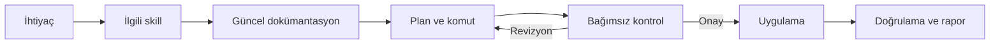

Bugün geliştirmeden Kubernetes ve Azure operasyonlarına, dokümantasyondan bu blogun yönetimine kadar işlerimin büyük bölümünü AI ile yürütüyorum. Ancak kararları AI'a devretmedim; işi standartlaştırıyor, sınırlarını yazıyor ve uygulanmasını ona bırakıyorum.

Bu noktaya tek bir iyi prompt yazarak gelmedim. Yerel model denemeleri, büyüyen skill dosyaları, tükenen token limitleri ve hataya açık otomasyonlar üzerinden ilerledim. Sonunda öğrendiğim şey şuydu: Bir modeli çalıştırmakla, güvenilir bir operasyon sistemi kurmak aynı şey değil.

## Yerel model fikri neden hâlâ cazip?

Yerel bilgisayarımda SaaS tabanlı bir agent çalıştırmak ilk zamanlarda beni ciddi biçimde tedirgin ediyordu. Veri gizliliği, şirket bilgilerinin dışarı çıkması ve hangi içeriğin hangi sağlayıcıya gönderildiği hâlâ önemsediğim konular. Bunların kolay veya herkes için geçerli tek bir cevabı yok.

Modeli tamamen yerelde ve çevrimdışı çalıştırma fikri bu nedenle çok çekici. Fakat bulut servislerinden aldığımız katma değer yalnızca model ağırlıklarından gelmiyor. Arama motoru, web istemcisi, doküman ayrıştırıcıları, indeksleme, kod çalıştırma ortamı, araç bağlantıları, kimlik ve izin yönetimi gibi katmanlar modelin iş kalitesini doğrudan etkiliyor.

Yerelde yalnızca bir model ayağa kaldırdığınızda çoğu zaman gelişmiş bir sohbet botu elde ediyorsunuz. Aynı kalite ve hareket alanı için modele araçlar, API'ler, arama, erişim politikaları, gözlemlenebilirlik ve bir yürütme ortamı sağlamanız gerekiyor. Bunu yeterince ileri götürdüğünüzde kendiniz için küçük bir AI platformu kurmaya başlıyorsunuz.

Bu tercih yanlış değil. Kendi e-posta sunucunuzu evde çalıştırmaya benziyor: Yapabilirsiniz, belirli koşullarda yapmanız da gerekebilir; fakat bakım, güvenlik, donanım ve zaman maliyetini de üstlenirsiniz. Büyük bir kurum değilseniz, yoğun kullanım üretmiyorsanız veya bu altyapıdan doğrudan gelir elde etmiyorsanız hazır hizmet çoğu zaman daha ekonomik kalıyor. Benim denemelerimde de sonuç bu oldu.

## Model tek başına operatör değildir

LLM, kendisine verilen bağlama göre olası çıktıyı üretir. “Bilmiyorum” diyebilir; fakat bu, her bilgi boşluğunu güvenilir biçimde tespit ettiği anlamına gelmez. Eksik talimatın bıraktığı alanı makul görünen bir tahminle doldurması özellikle operasyon işlerinde tehlikelidir.

Bir kullanıcı yönetimi API'sinin iyi hazırlanmış dokümantasyonunu modele verdiğimizi düşünelim. Endpoint, kimlik doğrulama, istek gövdesi ve hata cevapları açıkça yazılmışsa doküman aynı zamanda çalışma bağlamının bir parçası olur. Agent, kullanıcı oluşturmak için gerekli çağrıyı hazırlayabilir ve çalıştığı ortamdan API'ye erişebiliyorsa isteği uygulayabilir.

Burada kritik ayrım erişimdir. Bulutta çalışan bir agent, yerel ağınızdaki servise kendiliğinden ulaşamaz. Yerel makinede veya ilgili ağ içinde çalışan bir agent, uygun kimlik bilgileri ve izinler sağlandığında bunu yapabilir. Modelin ne bildiği kadar, agent'ın nerede çalıştığı ve neye yetkili olduğu da sonucu belirler.

## API dokümanından skill'e

API dokümanı çağrının teknik biçimini açıklar. Skill ise bu API'yi kullanırken uyulacak operasyon politikasını tanımlar:

- Önce hangi doküman okunacak?
- Hangi ortam varsayılan kabul edilecek?
- Hangi işlemler yalnızca okunabilir olacak?
- Hangi değişiklik kullanıcı onayı gerektirecek?
- Sonuç nasıl doğrulanacak ve raporlanacak?
- Hata durumunda yeniden deneme mi, durma mı tercih edilecek?

Kullanıcı yönetimi uygulaması için hazırlanan bir skill, agent'a önce güncel API dokümanını bulmasını, uygun isteği üretmesini, değişikliğin etkisini kontrol etmesini ve sonucu bildirmesini söyleyebilir. Böylece genel amaçlı bir sohbet modeli, sınırları belirli bir uygulamayı işletebilen basit bir operatöre dönüşür.

Benim kullandığım temel akış şu:

Skill komut ezberletmez; doğru kaynağı nasıl bulacağını, hangi sınırlar içinde hareket edeceğini ve ne zaman duracağını tarif eder.

## İkinci ve üçüncü göz

Agent kod yazarken hata yapabildiği gibi API çağrısında da hata yapabilir. Geliştirme ortamındaki küçük bir hata zaman kaybettirir; production ortamındaki yanlış çağrı ise doğrudan veri ve hizmet kaybına dönüşebilir.

Bu yüzden skill içinde bağımsız kontrol adımları tanımlıyorum. İlk agent ihtiyacı yorumlayıp komutu hazırlar. Ayrı bağlamdaki ikinci agent, hem ihtiyacı hem de önerilen işlemi inceler. Onay vermezse işlem uygulanmaz; bulgular ilk akışa dönerek planın revize edilmesini sağlar.

Aynı modelin ikinci kez bakması yararlı olsa da ortak model hatasına karşı tam bağımsızlık sağlamaz. Risk yükseldiğinde farklı bir model veya sağlayıcı üzerinden çapraz kontrol uygulanabilir. Codex ile hazırlanmış bir değişikliği Claude ya da Gemini ile gözden geçirmek gibi görünen yöntem, sürecin içine yazıldığında kişisel bir alışkanlık olmaktan çıkar ve tekrarlanabilir kontrol mekanizmasına dönüşür.

Bu yine de matematiksel bir doğruluk garantisi değildir. İki model aynı yanlış varsayıma dayanabilir. Bu nedenle geri döndürülemez işlemlerde insan onayı, en az yetki, yedekleme, dry-run, işlem öncesi ve sonrası doğrulama gibi klasik kontroller devam etmelidir.

## Bir takımı simüle etmek

Junior, senior, lead, architect ve tester gibi roller ekiplerde boşuna ortaya çıkmadı. Her biri probleme farklı bir açıdan bakar ve farklı sorumluluk taşır. Benzer ayrımı agent iş akışına verdiğimde tek bir uzun prompt yerine rolü ve bağlamı sınırlandırılmış çalışmalar elde ediyorum.

Örneğin architect çözüm sınırlarını belirleyebilir, developer değişikliği uygulayabilir, reviewer risk ve tutarlılığı inceleyebilir, tester ise kabul ölçütlerini doğrulayabilir. Bu rollerin her biri ayrı bir insan olduğu için değil, aynı işin farklı sorularla incelenmesini sağladığı için değerlidir.

İş yalnızca sohbet bağlamında tutulduğunda geçmiş hızla kaybolur. Süreci issue yönetim sistemine taşıdığımda ise roller issue'yu ilerletir, yorum bırakır, çıktıları kaydeder ve işi sonraki role devreder. Böylece sanal ekip, yaşayan bir iş kaydı üzerinde çalışır.

## Yerel bir AI platformunun gerçek bileşenleri

Bu yapıyı kurarken kullanılabilecek açık kaynak veya self-hosted bileşenler mevcut. Fakat aşağıdaki tablo, “bir model indirdim” ile “operasyon yapabilen bir platform kurdum” arasındaki mesafeyi de gösteriyor:

| Katman | Örnek | Ne sağlar? |
| --- | --- | --- |
| Yerel model çalıştırma | [Ollama](https://github.com/ollama/ollama/blob/main/docs/api.md) | Modelleri yerelde yönetmek, REST API ve tool calling üzerinden kullanmak |
| Yüksek performanslı model sunumu | [vLLM](https://docs.vllm.ai/en/latest/serving/online_serving/openai_compatible_server/) | GPU üzerinde modelleri OpenAI uyumlu HTTP servisi olarak sunmak |
| Model gateway | [LiteLLM](https://docs.litellm.ai/) | Birden fazla model sağlayıcısını tek arayüz, yetkilendirme, limit ve maliyet takibi arkasında toplamak |
| Operatör ve kullanıcı arayüzü | [Open WebUI](https://docs.openwebui.com/) | Yerel ve bulut modellerini araçlar, doküman bilgisi ve kullanıcı arayüzüyle birleştirmek |
| Arama | [SearXNG](https://docs.searxng.org/) | Birden fazla kaynaktan sonuç toplayan, kendi ortamınızda çalıştırılabilen metasearch katmanı |
| Agent orkestrasyonu | [LangGraph](https://langchain-ai.github.io/langgraph/index.html) | Uzun süreli, state tutan ve insan onayı içerebilen agent akışları kurmak |
| Araç bağlantısı | [Model Context Protocol](https://modelcontextprotocol.io/docs/learn/architecture) | Araç, kaynak ve prompt'ları istemci-sunucu modeliyle agent'a açmak |
| Kod arama ve erişim | [CK](https://beaconbay.github.io/ck/) | Kod tabanında çevrimdışı hibrit ve semantik arama yapmak, sonuçları MCP üzerinden agent'a açmak |

Liste bir kurulum reçetesi değil. Kimlik yönetimi, secret saklama, sandbox, loglama, değerlendirme, yedekleme ve ağ politikaları gibi üretim sorumlulukları ayrıca çözülmek zorunda. GPU'lu bir cluster'ınız varsa bunları deneyebilirsiniz; eski kripto madencilerinin donanımı burada yeniden anlam kazanabilir. Yine de donanım kiralamak başka, güvenilir ve izole bir model hizmeti işletmek başka iştir.

Araçları kurmak bu sistemin en görünür, fakat çoğu zaman en kolay kısmıdır. Asıl çalışma; kurumun süreçlerini analiz etmek, karar ve yetki sınırlarını çıkarmak, doğru bağlamı doğru anda sağlamak, güvenlik kapılarını tasarlamak ve bütün parçaları mevcut platformlarla güvenilir biçimde birleştirmektir. Aynı araç listesi iki farklı kurumda tamamen farklı bir operasyon modeline dönüşebilir.

## Ben bu yapıyı nasıl uyguladım?

Kendi yönettiğim ve AI kullanımı için yetkilendirilmiş kapsamdaki Kubernetes cluster'larını, Azure servislerini, geliştirme işlerini, teknik dokümantasyonu, sosyal medya süreçlerini ve bu blogun yönetimini aşama aşama AI'a taşıdım. Bugün bilgisayar başında olmasam bile telefonumdan verdiğim talep yetkilendirilmiş çalışma ortamım üzerinden yürütülebiliyor. Biraz Iron Man'deki Jarvis benzetmesini çağrıştırıyor; fakat arkasında sihir değil, standart, erişim ve dokümantasyon var.

Her iş için aynı sırayı izliyorum:

1. İşi tekrarlanabilir bir standarda dönüştürüyorum.
2. Karar noktalarını ve yasak alanları yazıyorum.
3. Gerekli dokümantasyonu hazırlıyorum.
4. Skill'in doğru dokümanı seçmesini sağlıyorum.
5. Risk seviyesine göre review ve onay kapıları ekliyorum.
6. İşlem sonrasında sonucu bağımsız olarak doğrulatıyorum.

Doküman hazırlamak bazen kod yazmak kadar zaman alıyor. Fark şu: Eskiden hem kodu hem dokümanı üretirken artık bazı işlerde yalnızca iyi tanımı ve dokümanı bir kez hazırlıyorum. Tekrarlanan kodlama veya operasyon adımlarını agent aynı kaynağa dayanarak yürütebiliyor.

Dokümanda tahmine açık boşluk bırakmamak çok önemli. Bir fotoğrafımın izinsiz biçimde makaleye eklenmesini, özel mesajın yanlış kişiye gönderilmesini veya production veritabanına eski bir yedeğin dönülmesini istemem. Bu sınırlar yalnızca “dikkatli ol” cümlesiyle değil; hedef doğrulama, açık yasaklar, onay koşulları ve geri alma planıyla tanımlanmalı.

## Token duvarı ve optimizasyon

İlk kurduğum sistem çalışıyordu; fakat ekonomik değildi. Kullandığım yaklaşık 100 avroluk paketin haftalık limiti yetmemeye başladı. E-posta yönetimi, cluster ve Azure operasyonları, kod geliştirme, issue takibi ve çoklu review akışları aynı bütçeden token tüketiyordu. Uzun süre ek paket almak zorunda kaldım.

Asıl katma değerim bu noktadan sonra ortaya çıktı: Her göreve bütün bağlamı göndermek yerine yalnızca gerekli bağlamı seçmek.

İlk skill dosyalarımdan biri 100 bin kelimeyi aşmıştı. Bugün kendi kullanım senaryomda benzer kapsamı yaklaşık 5 bin kelimelik çekirdek talimat ve ihtiyaç anında okunan dokümanlarla yönetiyorum. Bu oran her işte aynı sonucu verecek genel bir tasarruf vaadi değil; doğru bağlam seçiminin etkisini gösteren kişisel bir örnek. Yaptığım şey yalnızca metni kısaltmak değil, bağlam mimarisini değiştirmekti.

- Ortak kuralları tek yerde tutuyorum.
- Göreve özel dokümanı ihtiyaç anında yüklüyorum.
- Agent'a bütün geçmişi değil ilgili issue ve dosyaları veriyorum.
- Çıktı biçimini ve uzunluğunu sınırlıyorum.
- Tekrarlanan açıklamalar yerine araçlardan yapılandırılmış sonuç alıyorum.
- Basit işlerde pahalı model ve çoklu review kullanmıyorum.

Bugün izin verilen kapsam içindeki teknik review, kod geliştirme, issue yönetimi, cluster ve platform operasyonlarıyla kişisel işlerimin büyük bölümü aynı paket içinde rahatça yürüyebiliyor. Kazanç yalnızca daha az token değil; modelin gereksiz bağlam içinde kaybolmaması sayesinde daha tutarlı sonuç.

Burada herkese uygulanabilecek tek bir optimizasyon reçetesi yok. İş türü, kullanılan araçlar, veri hassasiyeti, hata maliyeti ve beklenen çıktı birlikte analiz edilmeden bir kurum için doğru model, bağlam ve kontrol düzeni belirlenemez. Verimli bir yapı, hazır bir skill'i kopyalamaktan çok o işletmenin gerçek çalışma biçimini doğru okuyup ona özel bir sistem tasarlamayı gerektirir.

## İşveren, veri ve yetki sınırı

İş yerinizle ilgili süreçleri AI ile yürütüyorsanız teknik olarak yapabiliyor olmanız yeterli değildir. İşverenin politikası, müşteri sözleşmeleri, veri sınıflandırması, düzenleyici şartlar ve kullanılan sağlayıcının koşulları birlikte değerlendirilmelidir.

Savunma sanayii, sağlık, finans veya başka bir regüle alanda genel amaçlı SaaS hizmetine veri göndermek kabul edilemez olabilir. Böyle bir durumda kurum içi model, özel bulut, veri maskeleme veya yalnızca onaylanmış araçların kullanılması gerekebilir. Doğru çözüm sektöre, veriye ve tehdit modeline göre değişir.

Bu yüzden işe gizlice AI eklemek yerine güvenlik, hukuk, yönetim ve teknik ekiplerle açık bir model üzerinde anlaşmak gerekir. Agent'a verilen yetki de insan kullanıcının yetkisinden daha geniş olmamalıdır.

## Bana ne kazandırdı?

En görünür sonuç daha fazla iş üretmek değil, zamanımı geri kazanmak oldu. Sosyalleşmeye daha fazla vakit ayırabiliyorum. Oğlumla neredeyse her gün denize gidebiliyor, akşamları rahatça film izleyebiliyor ve baba-oğul zamanını daha verimli yaşayabiliyorum.

Eskiden bir etkinliğin ortasında zihnim hâlâ “bu teknik problemi nasıl çözerim?” sorusuyla meşgul olabiliyordu. Şimdi problemi kayıt altına alıp araştırma, alternatif üretme ve ilk uygulama adımlarını sisteme bırakabiliyorum. Ben yeniden karar noktasında sürece katılıyorum.

Bu, daha az sorumluluk anlamına gelmiyor. Operasyonları devrettim; sahipliği değil.

## Bağımlılık ve yetkinlik kaybı

AI ile yürütülen işlerde güçlü bir bağımlılık oluşuyor. Servise erişemediğinizde süreç durabilir. Daha önemlisi, uzun süre elinizi işin içinden çekerseniz kullandığınız teknolojiyi anlama ve sorun çözme kasınız zayıflayabilir.

Junior geliştirici temel becerileri hiç kazanamayabilir; senior geliştirici ise kullanmadığı ayrıntıları zamanla unutabilir. Agent'ı yönetmek, sistemi anlamanın yerini aldığında mühendislik rolü kolayca yalnızca müşteri olmaya dönüşür. Bu riski [Yapay Zekâ ve İnsan Zihni: Düşünmenin Erozyonu, Kodun Çürümesi ve Kontrolün Kaybı]() yazısında daha ayrıntılı ele almıştım.

Bu nedenle zaman zaman işi elle yapmak, üretilen komutu okuyabilmek, mimari kararı açıklayabilmek ve sistem arızalandığında AI olmadan müdahale edebilmek gerekiyor. Otomasyon, bilgi kaybı pahasına kazanılan hız olmamalı.

## Sonuç: Kararlar bende, uygulama AI'da

Geldiğim noktada AI benim için bir sohbet botu veya sınırsız yetkili sanal çalışan değil. Dokümanla beslenen, skill'lerle sınırlandırılan, gerektiğinde başka agent ve modeller tarafından kontrol edilen bir operasyon katmanı.

Başarılı delegasyon, AI'ın daha fazla karar vermesi değil; benim verdiğim kararları daha az tekrar, daha tutarlı kayıt ve daha düşük operasyon yüküyle uygulaması oldu. Böyle bir sistemin kurulması model seçiminden önce süreçlerin analiz edilmesini, kuruma özel yetki ve kontrol mekanizmalarının tasarlanmasını gerektiriyor. Teknoloji parçaları hazır olsa bile onları güvenilir bir çalışma modeline dönüştüren kısım bu tasarım emeği.

Son review hâlâ bende. Çünkü AI benim adıma işlem yapsa da yanlışlığın hesabını verecek olan model değil, benim.
